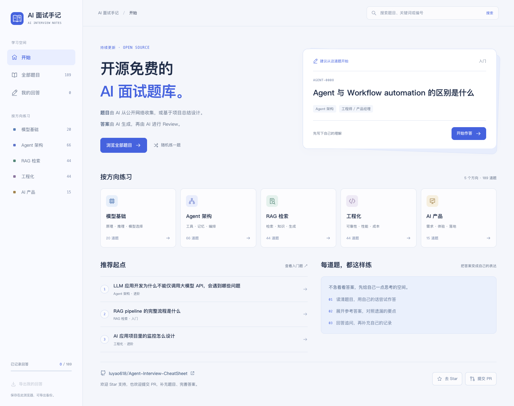
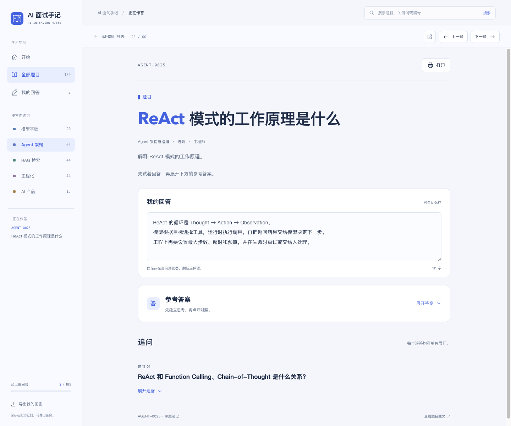
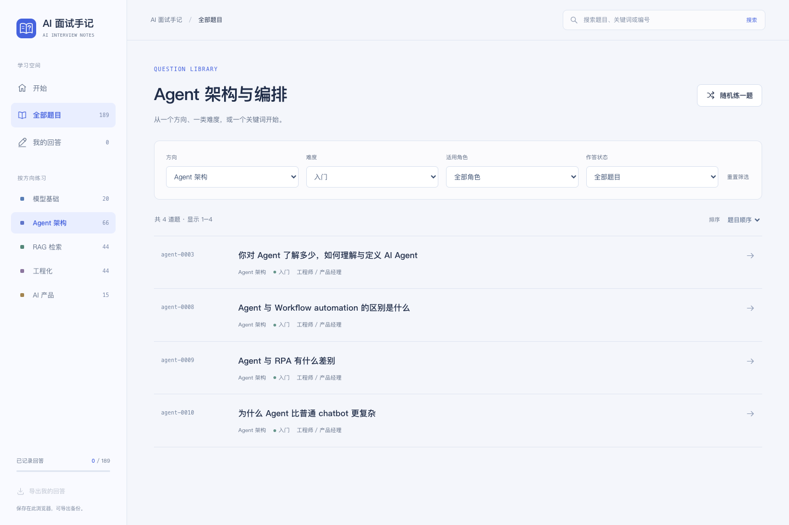
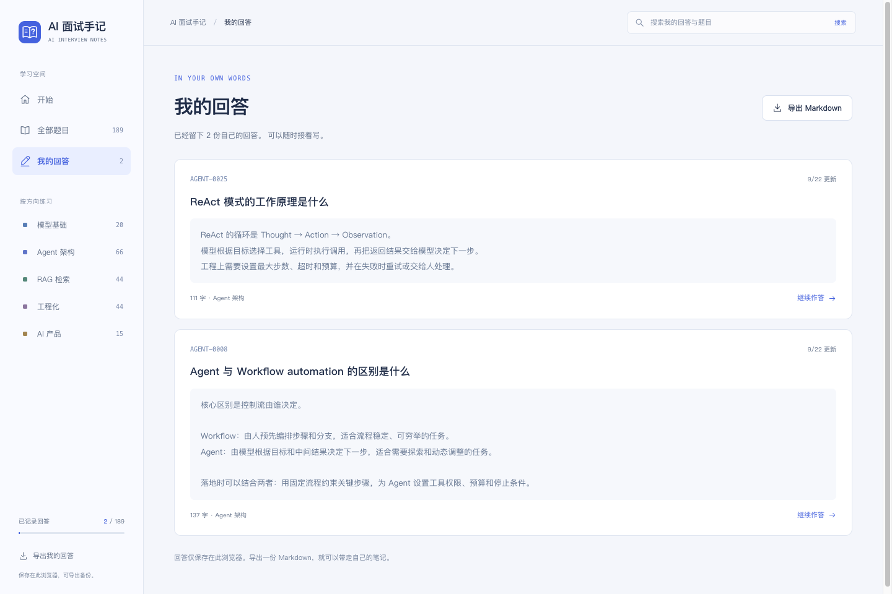
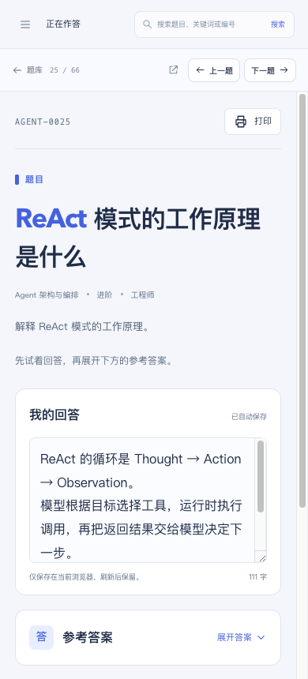

<p align="center">
  
</p>

# AI 面试手记

面向开发者与产品经理的开源 AI 面试题库。**先用自己的话回答，再展开参考答案，把理解留成笔记。**

[](https://luyao.blog/ai-interview/)
[](./LICENSE)
[](./CONTRIBUTING.md)

**[开始练习 →](https://luyao.blog/ai-interview/)** · [浏览 Markdown 题目目录](./index.md) · [贡献指南](./CONTRIBUTING.md)

[](https://luyao.blog/ai-interview/)

## 在这里练什么

目前收录 **189 道题，覆盖 5 个方向**，从模型基础、AI 应用构建到工程化与产品落地。题目支持按入门 / 进阶 / 困难，以及工程师 / 产品经理筛选。

| 方向 | 题数 | 主要内容 |
| :--- | ---: | :--- |
| [模型基础](https://luyao.blog/ai-interview/#questions?category=llm) | 20 | 模型原理、推理、微调、模型选择与能力边界 |
| [Agent 架构](https://luyao.blog/ai-interview/#questions?category=agent) | 66 | 工具调用、MCP、记忆、Context、Workflow 与编排 |
| [RAG 检索](https://luyao.blog/ai-interview/#questions?category=rag) | 44 | 文档处理、向量检索、Rerank、知识更新与生成质量 |
| [工程化](https://luyao.blog/ai-interview/#questions?category=engineering) | 44 | 评测、监控、可靠性、安全、部署、性能与成本 |
| [AI 产品](https://luyao.blog/ai-interview/#questions?category=product) | 15 | 场景判断、需求拆解、体验、指标、商业化与落地 |

题目由 AI 从公开网络收集，或基于项目总结设计；参考答案由 AI 生成，再由 AI Review。答案保留署名，题目中的参考资料可供延伸阅读，欢迎结合实践纠错、补充不同解法。

## 怎样练一题

1. **选题**：搜索标题、编号或关键词，按方向、难度、角色和作答状态筛选，也可以在当前范围内随机选题。
2. **先回答**：在「我的回答」里写下思路。参考答案默认收起，给自己独立组织表达的空间。
3. **再对照**：展开参考答案与追答，核对遗漏的要点，再补充自己的记录。
4. **回头复习**：从「我的回答」继续修改，或导出 Markdown，整理到自己的笔记里。

[](https://luyao.blog/ai-interview/#question/agent-0025)

**回答自动保存在当前浏览器的 localStorage，不上传服务器。** 换浏览器、域名或端口不会自动同步；清理浏览器数据前，可以导出 Markdown 留存。

## 从选题到复习

| 按方向查找题目 | 留下自己的回答 |
| :---: | :---: |
| [](https://luyao.blog/ai-interview/#questions?category=agent&difficulty=easy) | [](https://luyao.blog/ai-interview/#answers) |
| 搜索、组合筛选、分页浏览，沿当前题集逐题练习。 | 汇总作答记录，搜索回答文字，导出复习笔记。 |

还支持继续上次题目、手机端导航、图片与流程图放大、打印题目和答案。[ReAct 示例](https://luyao.blog/ai-interview/#question/agent-0025)中提供逐步演示，可以观察正常返回与工具超时两种场景。

<details>
<summary>查看手机端截图</summary>

<p align="center">
  
</p>

</details>

<sub>截图来自在线站点；「我的回答」中的文字为演示填写。原始素材与拍摄说明见 <a href="./assets/screenshots/README.md">截图目录</a>。</sub>

## 不知道从哪道开始

| 学习目标 | 建议起点 |
| :--- | :--- |
| 判断什么时候需要 Agent | [Agent 与 Workflow 的区别](https://luyao.blog/ai-interview/#question/agent-0008) → [为什么不能只调大模型 API](https://luyao.blog/ai-interview/#question/agent-0035) |
| 理解 AI 应用怎么搭起来 | [Prompt 与 Context engineering](https://luyao.blog/ai-interview/#question/agent-0019) → [RAG 完整流程](https://luyao.blog/ai-interview/#question/rag-0023) → [Function Calling 设计](https://luyao.blog/ai-interview/#question/agent-0004) |
| 准备生产环境中的取舍题 | [AI 应用监控](https://luyao.blog/ai-interview/#question/engineering-0006) → [用户不在时如何处理人工接管](https://luyao.blog/ai-interview/#question/agent-0042) |
| 从产品视角准备面试 | [AI 场景优先级](https://luyao.blog/ai-interview/#question/product-0001) → [AI 产品指标](https://luyao.blog/ai-interview/#question/product-0003) → [上线评测与迭代](https://luyao.blog/ai-interview/#question/product-0006) |

完整的 Developer / PM 学习路径见[题目目录](./index.md)，按 L0 基础判断 → L1 模型与知识 → L2 应用构建 → L3 生产化治理 → L4 产品交付组织。

## 本地使用

仓库已包含生成好的静态网页，浏览题库不需要构建，也不需要后端服务。

```sh
git clone https://github.com/luyao618/Agent-Interview-CheatSheet.git
cd Agent-Interview-CheatSheet
python3 -m http.server 8000 --bind 127.0.0.1
```

打开 **[localhost:8000/html/](http://localhost:8000/html/)** 即可练习。也可以直接用浏览器打开 `html/index.html`；为了让主页稳定汇总各题的回答，推荐使用上面的本地 HTTP 服务。

页面内嵌样式、脚本、图片与已渲染的流程图，离线也能阅读和作答。

## 仓库结构与维护

```text
Agent-Interview-CheatSheet/
├── questions/            # 题目与答案的 Markdown 源文件
├── index.json            # 题目索引与分类定义
├── index.md              # 自动生成的 Markdown 目录
├── html/                 # 自动生成的学习主页与单题网页
├── templates/            # 页面模板、样式、交互与流程图缓存
├── scripts/              # 目录 / 网页生成与校验
├── assets/screenshots/   # README 截图素材
└── CONTRIBUTING.md       # 投稿流程、元数据与单题格式
```

**更新内容请编辑 `questions/*.md` 和 `index.json`，更新界面请编辑 `templates/`，然后重新生成。** 不要直接修改 `html/` 中的生成文件。

首次安装构建依赖（Python 3.11+）：

```sh
python3 -m venv .venv
.venv/bin/python -m pip install -r scripts/requirements-html.txt
```

生成与检查：

```sh
.venv/bin/python scripts/gen_index.py
.venv/bin/python scripts/gen_html.py
.venv/bin/python scripts/gen_html.py --check
.venv/bin/python -m unittest discover -s scripts/tests -v
```

已有 Mermaid 图的 SVG 缓存随项目提供；新增或修改 Mermaid 图时，先运行 `npm --prefix scripts/diagram-renderer ci`。更多说明见[单题模板](./templates/question/README.md)和[学习主页模板](./templates/workspace/README.md)。

## 一起完善题库

欢迎通过 [Issue](https://github.com/luyao618/Agent-Interview-CheatSheet/issues) 反馈错误、提出想看的题目，也欢迎通过 PR 补充答案、来源、英文翻译或改进学习体验。新增题目前请阅读[贡献指南](./CONTRIBUTING.md)。

如果这份题库对你有帮助，欢迎 [Star](https://github.com/luyao618/Agent-Interview-CheatSheet)。

## License

[MIT](./LICENSE)
