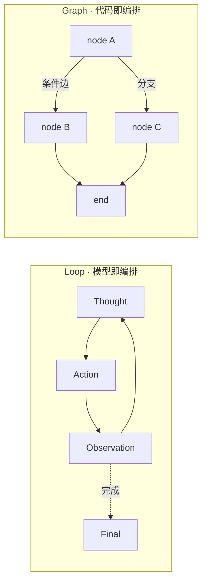

## 问题

你怎么理解最近比较火的 loop 工程和 graph 工程？

## 答案 · Claude-Opus-4.8

> 🤖 AI 答案 · 模型：Claude-Opus-4.8 · 回答 2026-07-28

**核心结论**：loop 与 graph 是搭 Agent 的两种控制流范式，本质区别在于**「下一步由谁决定、以什么形式表达」**——loop 把控制流交给模型在运行时即兴决定，graph 把控制流预先固化成一张显式的图、由运行时驱动。

**Loop（ReAct 式单体循环）**
- **形态**：一个 `while` 反复喂 LLM——Thought → Action → Observation，模型自己判断调哪个工具、是否继续、何时收尾。控制流是**隐式、涌现**的，藏在每轮决策里。
- **优点**：实现极简、灵活；任务开放、路径不可预知（探索式检索、开放问答）时表现好。
- **代价**：轨迹不可预测、难复现；易绕圈或提前收尾；上下文单向累积、长任务易膨胀失焦；可观测与可干预性差。

**Graph（显式状态机 / DAG 编排）**
- **形态**：把流程画成节点（步骤）+ 边（转移条件）的图，状态在节点间显式流转，分支 / 循环 / 并行都是图里写死的结构（LangGraph 为典型）。控制流**显式、可检视**。
- **优点**：路径可控可复现；天然支持分支、并行、回环、检查点与断点续跑；边界清晰，好测试、好加护栏、好接 human-in-the-loop。
- **代价**：要预先把流程想清楚并写出来，前期成本高、灵活性低；面对高度开放的任务，图易爆炸或频繁改结构。

**本质差异（一句话）**：loop 是「模型即编排」，决策权全给 LLM；graph 是「代码即编排」，结构交给工程师、只在节点内部保留局部智能。

**取舍与边界**
- 开放、步骤不定、要快速起步 → **loop**。
- 流程相对固定、要可靠 / 可复现 / 可审计、需并行与断点续跑 → **graph**。
- 生产常**混合**：外层 graph 定骨架保可控，个别节点内部塞一个小 loop 处理开放子问题；也可先用 loop 探路、跑通后把稳定路径「固化」成 graph。二者不对立，而是**灵活性 ↔ 可控性**光谱的两端。

> **要点**
> - loop = 模型运行时即兴决定控制流（隐式、灵活、难复现）
> - graph = 预先固化的状态机 / DAG（显式、可控、前期成本高）
> - 本质：决策权在模型 vs 在工程师
> - 边界：开放探索用 loop，可靠可审计用 graph，生产常混合

## 延伸 / 追问

**追问：loop / graph 跟 single-agent、multi-agent、workflow 是什么关系？**

不在一个维度，别混为一谈：

- **loop vs graph**：讲**单个执行体内部的控制流**怎么组织——即兴循环还是显式图。
- **single vs multi-agent**：讲**有几个自治决策体、如何分工协作**（supervisor / pipeline 等）。它与 loop/graph 正交：一个 multi-agent 系统完全可以用一张 graph 把多个 agent 编排起来，而每个 agent 内部各自跑一个 ReAct loop。
- **workflow**：与 graph 高度重合但不等同。workflow 通常指**路径完全写死、无模型自主决策**的自动化编排；graph 允许节点内嵌 LLM 决策、条件边由模型输出驱动，介于纯 workflow 与纯 loop 之间。可理解为 workflow 是 graph 里「低自主度」的特例，loop 则是「高自主度」的另一极。

选型先问三件事：**路径确定吗？要几个决策体？每一步要不要模型拍板？**

## 参考

- Yao et al., *ReAct: Synergizing Reasoning and Acting in Language Models*, 2022：https://arxiv.org/abs/2210.03629
- LangGraph Docs（显式图 / 状态机编排、检查点与 human-in-the-loop）：https://langchain-ai.github.io/langgraph/
- Anthropic, *Building Effective Agents*（workflow 与 agent 的选型与取舍）：https://www.anthropic.com/engineering/building-effective-agents
