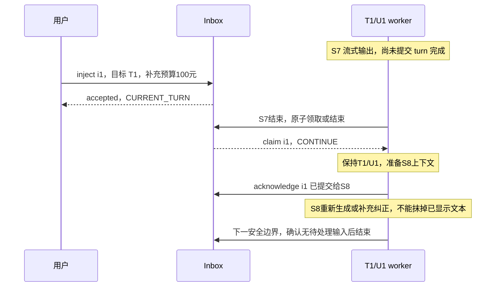
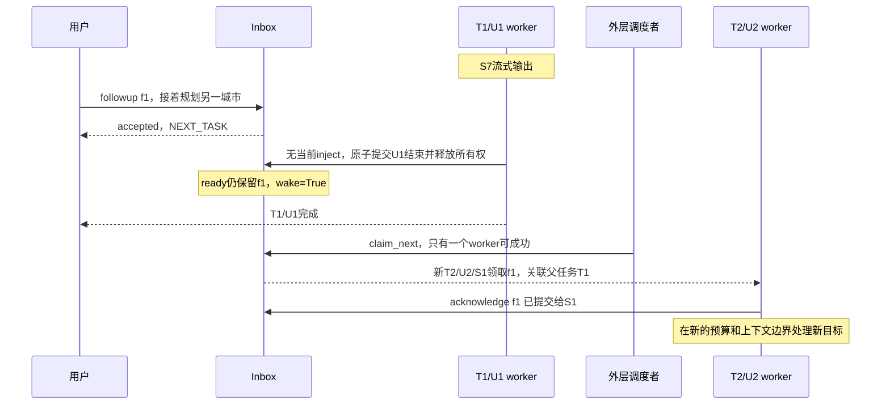

## 问题

Agent 运行中收到用户插话时，如何区分续问、转向和信息注入，并决定哪一层继续运行？画出“流式最后一步收到 inject”和“收到新任务 follow-up”的两条时间线，说明原子领取、空闲及终止边界怎样避免迟到输入丢失。

## 答案 · GPT-6

> 🤖 AI 答案 · 模型：GPT-6 · 日期 2026-09-16

**先决定输入要影响哪项工作，再决定何时领取；一次模型流结束，只是循环能否停止的候选信号。** 信息补充、修改目标、下一个任务和明确取消具有不同语义，不应都转换成 abort，也不应把“已入队”显示成“模型已处理”。

[agent-0052](agent-0052-async-event-presentation-to-model.md) 讨论事件内容如何组织，[engineering-0009](engineering-0009-async-agent-event-priority.md) 讨论优先级。本题补充领取时点和循环生命期；副作用取消后是否真的停止、容量何时归还，参见 [engineering-0021](engineering-0021-llm-queue-backpressure.md)。

### 1. 先约定层次，再解释输入意图

下面用一套**教学命名**，不是所有 SDK 的统一定义：

| 层次 | 本文含义 | 停止条件不能混同 |
| --- | --- | --- |
| task | 外层调度与所有权单元，有 task ID、预算、父任务关联；示例中新目标创建新 task | 当前 worker 退出，不等于会话 Inbox 可以销毁 |
| turn | 一次业务响应过程，可以包含多次模型/工具交互 | 需要处理完属于本 turn 的已接纳输入，或给出明确延期/拒绝处置 |
| step | 一次模型采样及其需要收尾的工具结果处理边界 | 一步没有 tool call，不代表没有待领取的用户输入 |

续问通常保留相关上下文、排到下一次响应；**新目标的 follow-up** 可以由产品选择建立新 task。转向是改变当前目标或约束，应明确是否需要停止旧计划；信息注入只补充事实，通常不撤销当前工作。这里的 inject 指经过授权的用户补充输入，不是把网页内容升级为用户指令，也不等同于 prompt injection 攻击。

可以把意图和投递方式拆成两维：`intent=补充/改向/续问/取消`，`delivery=当前安全边界/下一轮/新任务`。用户“顺便解释一下”若语义不清，应先沿用当前目标或请求澄清，不能为了实现方便总是启动新任务。确定含义后，保存带 message ID、目标 task/turn、来源、内容和回执状态的结构化 envelope，而不是让每层各猜一次。

| 策略 | 适用条件 | 代价和限制 |
| --- | --- | --- |
| 当前安全边界领取 inject/steer | 补充事实、调整尚未执行的计划；等待当前可收尾步骤可以接受 | 不能回改已发出的 Token，响应要等到安全点；已提交副作用不能靠插话撤销 |
| 下个业务 turn / 新 task 处理 follow-up | 依赖当前答案的续问，或用户明确要求接着做另一项工作 | 需要保留任务关联、结果引用和独立调度；原任务结束不应清掉这条队列 |
| 显式取消/抢占，再按策略重开 | 用户要求停下，或安全/授权变化要求阻止后续动作 | 必须按工具契约确认停止/对账；取消本地等待不证明远端动作未执行，不适合所有普通补充消息 |

若转向涉及“不再付款”等副作用限制，应用应在动作提交前检查最新授权/版本，必要时走单独的停止信号。不要指望模型在下一步读到一句 inject，就能撤销上一条已发出的动作。

### 2. 两条时间线：流式最后一步不是同一个终点

假设 T1/U1 的 S7 正在输出最后一段文本，随后没有工具调用；这里采用“当前目标的 inject 继续 U1，新目标 follow-up 创建 T2”的教学政策。S7 输出暂态内容，最终完成事件在 Inbox 决策之后发布。



注入是在**下一次采样前**进入上下文，不能倒流进已开始的 S7 请求。即使 S7 返回“正常停止”，只要 i1 在同一临界区的结束检查之前被接纳，U1 仍要继续；不能先把 i1 从队列取走，再因“无工具调用”丢弃它。界面应区分暂态文本、修订/补充输出和真正完成事件，不能假装模型从一开始就知道补充条件。



若 inject 反而在 U1 的结束提交**之后**才到，不能再交给已经退出的 worker。本例明确改排 `NEXT_TASK`，回执可查询，建立关联 T1 的后续处理；其他产品也可以选同 task 的新 turn，但须明确约定。已关闭的会话则显式拒绝并提示重提；不能对外返回 accepted 后直接丢掉。

### 3. 领取与退出必须共享一个原子决策点

最危险的写法是“读队列为空 → 解锁 → 设置 idle/退出”。输入可以在中间入队，以为还有活跃消费者，消费者却已经决定离开，形成丢失唤醒。`isRunning` 布尔值本身不能消除此竞态；生产者与退出者必须按同一状态和版本作决策。

一个可实现的协议是：

1. **接纳。** 校验权限、目标、容量和 idempotency key；持久记录 message 与投递目的地，之后才返回 accepted。重复 ID 的同一有效载荷返回原回执，冲突载荷拒绝。拒绝不等于已经接纳。
2. **原子领取或退出。** 在锁/事务内检查 owner epoch：有当前输入则 `PENDING → CLAIMED` 并保留循环；没有输入且步骤可以停止，才提交 turn 完成、释放 owner，并为后续队列记录 ready/wakeup。领取所有权不能只靠先 peek 再 pop。
3. **确认应用。** worker 将已领取消息纳入相应上下文后确认；claim 不证明模型见到，更不证明理解或遵循了它。尚有未确认 claim 时不得当作“无输入”结束。不要删除唯一的消息副本。
4. **外层恢复。** idle 时入队与 ready/outbox 写入放在同一事务；两个 worker 竞争时只有一个获得有效 epoch。通知可重复或丢失，所以以持久状态重新扫描为准；旧 owner/旧 task 回调不能领取或确认新任务的消息。

这样只有两种线性化结果：输入先提交，当前循环继续；退出先提交，输入看到 idle 并显式改排。**idle 是仍可接纳的调度状态，closed 是拒绝新输入的会话状态**，都不同于某个模型流的 stop event。

进程内可以用互斥锁；跨进程需要共享存储的事务/CAS、唯一领取约束和所有权 fence。单机锁、一次线程测试或数据库行锁都不能自动证明远端模型调用 exactly-once。worker 崩溃后的 lease/reclaim、重复交付及上下文提交对账也要另做设计；预算耗尽时应明确延期或拒绝，不能靠连续 inject 无限续跑。

### 4. 一个具体运行时的术语和领取点

一手源码固定为 Pi **v0.57.1**（包 `@mariozechner/pi-agent-core`），commit `a9cedccdde77e9d765303463d8a6cd11c58f7a7f`，MIT；仓库旧地址 badlogic/pi-mono 当前重定向到 earendil-works/pi。这里只核对这一快照，**没有运行 Pi 或调用其模型后端**。

- [types.ts:78–97、177–185](https://github.com/earendil-works/pi/blob/a9cedccdde77e9d765303463d8a6cd11c58f7a7f/packages/agent/src/types.ts#L78-L97) 定义 steering/follow-up 回调；该文件把一次 assistant 响应及工具结果称为 [turn](https://github.com/earendil-works/pi/blob/a9cedccdde77e9d765303463d8a6cd11c58f7a7f/packages/agent/src/types.ts#L177-L185)，更接近本文的 step，不能直接套用前表。
- [agent-loop.ts:114–197](https://github.com/earendil-works/pi/blob/a9cedccdde77e9d765303463d8a6cd11c58f7a7f/packages/agent/src/agent-loop.ts#L114-L197) 在循环开始及响应/工具处理后的边界读取 steering；内层没有工具调用和 steering 后，外层检查 follow-up。有 follow-up 时再次进入同一 agent loop，**不等于新建平台 task**；两类都为空才发正常的 agent_end。
- [工具执行后的检查](https://github.com/earendil-works/pi/blob/a9cedccdde77e9d765303463d8a6cd11c58f7a7f/packages/agent/src/agent-loop.ts#L364-L375) 若读到 steering，会跳过该响应剩余的工具调用。它不把已经完成的工具结果撤回，也不是在接收消息瞬间强杀执行中的工具。
- [Agent.steer/followUp 与出队](https://github.com/earendil-works/pi/blob/a9cedccdde77e9d765303463d8a6cd11c58f7a7f/packages/agent/src/agent.ts#L254-L317) 使用内存队列；这两个入队方法本身没有启动新 loop。[continue():380–405](https://github.com/earendil-works/pi/blob/a9cedccdde77e9d765303463d8a6cd11c58f7a7f/packages/agent/src/agent.ts#L380-L405) 则显式处理 idle 时已有的队列，并在正在运行时拒绝 continue。因此业务宿主仍需约定何时调用恢复入口，不能从入队函数推出自动持久唤醒。

此外，流返回 error/aborted 时 [agent-loop.ts:144–149](https://github.com/earendil-works/pi/blob/a9cedccdde77e9d765303463d8a6cd11c58f7a7f/packages/agent/src/agent-loop.ts#L144-L149) 会直接结束，不能把正常路径的尾部轮询保证套在错误分支上。对迟到、错误和终止时排队输入的处置，需要应用/宿主层证据；仅这段库源码没有证明前节的持久接纳、跨 worker 原子领取或业务任务政策。

### 5. 可复跑的教学 Inbox

下面是原创 **Python 3.11.8 进程内模型**。初始化已有 T1/U1/S7，worker token 为 `(w0,1)`；inject 只有目标仍是当前 task 才投本 turn，其余接纳消息进入新 task 队列。示例中每个新 task 开一个业务 turn，不模拟所有同 task 多 turn 策略。

`finish_step` 由调用方在当前步骤及必要工具收尾完成后调用，`wants_stop` 是候选停止意图；只要有当前输入，就领取并继续。`APPLIED` 是 runner 确认已提交到指定上下文的**教学状态**，不是模型实测。`wake` 是内存调度意图，外层测试显式 claim，不是已实现的通知服务。容量限制为最多 32 条记录，含历史回执；生产应分别管理等待队列和回执保留期。

<details>
<summary>展开原子领取与两条时间线的 Python 模型</summary>

```python
"""Original in-memory teaching mailbox; Python 3.11.8, no scheduler/model I/O."""
from copy import deepcopy
from threading import Lock


def label(value):
    if type(value) is not str or not value.strip() or len(value) > 80:
        raise ValueError("invalid label")


class Inbox:
    def __init__(self, capacity=32):
        if type(capacity) is not int or capacity < 1:
            raise ValueError("invalid capacity")
        self.lock = Lock()
        self.capacity, self.closed, self.wake = capacity, False, False
        self.messages, self.ready = {}, []
        self.epoch, self.last_task, self.last_turn = 1, 1, 1
        # Fixture: T1/U1 is streaming its nominal final step S7.
        self.current = dict(task=1, turn=1, step=7, token=("w0", 1),
                            inbox=[], claimed=[], parent=None)

    def owner(self, token):  # Called only while holding self.lock.
        if (type(token) is not tuple or len(token) != 2
                or type(token[0]) is not str or type(token[1]) is not int
                or self.current is None or token != self.current["token"]):
            raise ValueError("stale or invalid owner")
        return self.current

    def submit(self, message_id, kind, target, text):
        label(message_id)
        if kind not in ("inject", "followup") or type(text) is not str or not text or len(text) > 200:
            raise ValueError("invalid message")
        if target is not None and (type(target) is not int or target < 1):
            raise ValueError("invalid target")
        if kind == "inject" and target is None:
            raise ValueError("inject requires a target task")
        payload = (kind, target, text)
        with self.lock:
            old = self.messages.get(message_id)
            if old is not None:
                if old["payload"] != payload:
                    raise ValueError("same id, different payload")
                return old["route"], old["state"]
            if self.closed:
                return "REJECT_CLOSED", None
            if target is not None and target > self.last_task:
                return "REJECT_UNKNOWN_TARGET", None
            if len(self.messages) >= self.capacity:
                return "REJECT_FULL", None
            here = kind == "inject" and self.current is not None and self.current["task"] == target
            route = "CURRENT_TURN" if here else "NEXT_TASK"
            self.messages[message_id] = dict(payload=payload, route=route, state="PENDING", applied_at=None)
            if here:
                self.current["inbox"].append(message_id)
            else:
                self.ready.append(message_id)
                self.wake = self.current is None
            return route, "PENDING"

    def finish_step(self, token, wants_stop=True):
        if type(wants_stop) is not bool:
            raise ValueError("invalid stop candidate")
        with self.lock:
            run = self.owner(token)
            if run["claimed"]:
                raise ValueError("claimed input has not been acknowledged")
            if run["inbox"]:
                ids = tuple(run["inbox"])
                run["inbox"].clear()
                run["claimed"] = list(ids)
                run["step"] += 1
                for mid in ids:
                    self.messages[mid]["state"] = "CLAIMED"
                return "CONTINUE", ids
            if not wants_stop:
                run["step"] += 1
                return "CONTINUE", ()
            # Empty-check and releasing ownership are in the same critical section.
            self.current = None
            self.wake = bool(self.ready)
            return "TURN_DONE", ()

    def claim_next(self, worker):
        label(worker)
        with self.lock:
            if self.closed or self.current is not None or not self.ready:
                return None
            mid = self.ready.pop(0)
            self.epoch += 1
            self.last_task += 1
            self.last_turn += 1
            token = (worker, self.epoch)
            self.current = dict(task=self.last_task, turn=self.last_turn, step=1,
                                token=token, inbox=[], claimed=[mid],
                                parent=self.messages[mid]["payload"][1])
            self.messages[mid]["state"] = "CLAIMED"
            self.wake = False
            return token, mid

    def acknowledge(self, token, ids):
        if type(ids) is not tuple or not ids or any(type(mid) is not str for mid in ids):
            raise ValueError("invalid acknowledgement")
        with self.lock:
            run = self.owner(token)
            if list(ids) != run["claimed"]:
                raise ValueError("acknowledgement does not match claim")
            for mid in ids:
                self.messages[mid]["state"] = "APPLIED"
                self.messages[mid]["applied_at"] = (run["task"], run["turn"], run["step"])
            run["claimed"].clear()

    def close(self):
        with self.lock:
            if self.current is not None or self.ready:
                raise ValueError("cannot close with live or pending work")
            self.closed, self.wake = True, False

    def snapshot(self):
        with self.lock:
            return deepcopy(dict(current=self.current, ready=self.ready, messages=self.messages,
                                 wake=self.wake, closed=self.closed, epoch=self.epoch))


if __name__ == "__main__":
    a = Inbox()
    assert a.submit("i1", "inject", 1, "补充：预算是100元") == ("CURRENT_TURN", "PENDING")
    assert a.finish_step(("w0", 1)) == ("CONTINUE", ("i1",))
    a.acknowledge(("w0", 1), ("i1",))
    assert a.snapshot()["messages"]["i1"]["applied_at"] == (1, 1, 8)
    assert a.finish_step(("w0", 1)) == ("TURN_DONE", ())
    b = Inbox()
    assert b.submit("f1", "followup", 1, "接下来为另一城市做计划") == ("NEXT_TASK", "PENDING")
    assert b.finish_step(("w0", 1)) == ("TURN_DONE", ())
    token, mid = b.claim_next("w1")
    b.acknowledge(token, (mid,))
    assert b.snapshot()["messages"]["f1"]["applied_at"] == (2, 2, 1)
    print("PASS: inject -> T1/U1/S8; followup -> T2/U2/S1; no cancellation")
```

</details>

运行断言得到：`inject → T1/U1/S8`，`followup → T2/U2/S1`，两条消息均没有触发取消。进程内锁保护领取/退出状态；此模型没有数据库、crash recovery、lease 接管、真实模型/工具执行或实际调度修改。它保留可检查消息状态，不能用来承诺进程崩溃后的不丢失或 exactly-once。

## 延伸 / 追问

**输入恰好在最终答案最后一个 Token 后到达，算当前 turn 还是下一轮？** 看应用的完成提交线性化点，不只看 Token 时间。提交前可按政策领取并继续；提交后交给新的 turn/task，或对 closed 会话明确拒绝。已经展示的文字需要补充/修订标识，不能声称当时的生成已经参考了迟到输入。

**为什么“领取一次”还不够？** worker 可能在 pop 后、提交上下文前崩溃；没有 claim 记录与确认就无法区分未处理和已处理。持久实现需可恢复 claim、epoch、防重复应用和适用的重试/对账；对外部副作用不能仅凭消息去重宣称 exactly-once。

**转向与“停止”是否都调用 abort？** 不一定。修改预算或补事实可以在安全边界继续；明确停止或撤销授权则走独立控制路径，并处理工具的 running/committed/unknown 状态。转向影响后续决策，不自动撤销过去动作。

## 常见误区

- “任何插话都要取消重来”：会浪费进度，也可能重复已经提交的副作用。
- “流结束/无 tool call 就可以退 worker”：还需原子决定当前输入、未确认 claim 和后续任务的去向。
- “队列 pop 了就代表模型处理了”：领取、提交上下文、模型响应和业务完成是不同状态。
- “isRunning 读成 true，消息就肯定有人接”：若检查与退出不共享原子协议，仍可能丢失唤醒。
- “所有 SDK 的 turn/follow-up 同义”：库层循环、业务 task 和平台运行生命期必须分别核对，不能凭名字推断。

## 参考

- 洛小山，《AI 产品从入门到精通》learn-ai，固定 commit `5a933d287dd5074cc1543cb849146f3261d47521`：[slides/codex-02.html](https://github.com/itshen/learn-ai/blob/5a933d287dd5074cc1543cb849146f3261d47521/slides/codex-02.html)、[slides/codex-04.html](https://github.com/itshen/learn-ai/blob/5a933d287dd5074cc1543cb849146f3261d47521/slides/codex-04.html)、[slides/dsh-3.html](https://github.com/itshen/learn-ai/blob/5a933d287dd5074cc1543cb849146f3261d47521/slides/dsh-3.html)。只作问题线索，不搬运 AGPL 课件，也不将课程对其他运行时的术语和实现判断冒充 Pi 的保证。
- Mario Zechner / Pi，**v0.57.1 / `a9cedccdde77e9d765303463d8a6cd11c58f7a7f`**：[agent package.json](https://github.com/earendil-works/pi/blob/a9cedccdde77e9d765303463d8a6cd11c58f7a7f/packages/agent/package.json)、[README 的 steering/follow-up](https://github.com/earendil-works/pi/blob/a9cedccdde77e9d765303463d8a6cd11c58f7a7f/packages/agent/README.md#L252-L289)、[MIT LICENSE](https://github.com/earendil-works/pi/blob/a9cedccdde77e9d765303463d8a6cd11c58f7a7f/LICENSE)；具体调用位置见正文固定源码链接。
- 来源核对与教学模型验证日期为 **2026-09-16**。时间线表示事件顺序，没有模型延迟、生产并发容量或真实计费数据；未修改本平台或其他真实运行时的调度。
