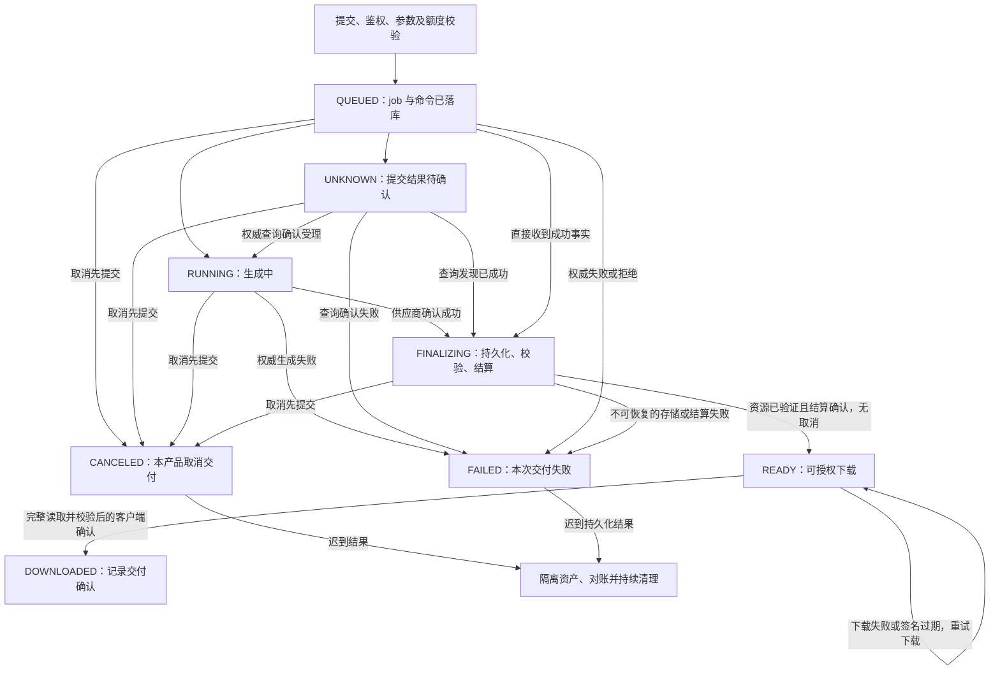

## 问题

把生图 API 做成产品时，任务状态、取消、重试、计费和资源交付应怎样约定？请画出提交到成功下载的状态机，覆盖取消后迟到结果、重复回调，以及“图片生成了但没有可靠交付”的情况。

## 答案 · GPT-6

> 🤖 AI 答案 · 模型：GPT-6 · 日期 2026-09-16

**把一次生图变成可查询的持久任务，并分别记录生成事实、交付承诺和账务事实。** 客户端连接结束不等于任务结束，供应商返回图片不等于本产品已可靠交付，取消交付也不等于供应商停算或已经退款。

通用幂等与补偿机制见 [engineering-0002](engineering-0002-idempotency-distributed-transaction.md)，失败体验见 [product-0004](product-0004-ai-ux-failure-recovery.md)，调用费用对账见 [engineering-0016](engineering-0016-llm-billing-reconciliation.md)。本题把这些边界落实到长时生图 job，不重复生成质量或通用 Saga 的完整答案。

### 1. 提交后返回 job，客户端超时只改变等待体验

一种教学接口约定是：`POST /image-jobs` 在鉴权、参数校验、内部额度预占、job 与待发送命令持久化后返回 `202 + job_id + status_url`。RFC 9110 的 202 表示接受处理，不承诺最终成功。没有成功建立任务时应返回明确错误，不能先说“已受理”再丢失任务。

客户端为一次用户意图保存 idempotency key；服务端按 `(tenant, key)` 原子去重，并核对规范化参数摘要，包括模型版本、Prompt、参考资产版本、尺寸、张数和输出格式。同键同参数返回同一个 job；同键不同参数返回冲突，例如 409。超时后先按 key/job 查询或重传同键，不生成新键；相同参数但不同用户意图也不能被全局合并。去重保留期须覆盖约定重试窗口，过期后的行为要说明。

生成的物理 attempt、供应商 request ID、资产 ID 和账务 operation ID 各自独立关联。客户端重传不创建新的 generation attempt；供应商提交结果不明时保留 UNKNOWN，通过权威查询/对账恢复。如果上游没有幂等创建或查询能力，本地唯一键不能消除“远端已创建但回包丢失”的缺口，不能盲目再次生成并承诺只收费一次。

| 获取长任务结果的方式 | 优点 | 代价与边界 |
| --- | --- | --- |
| 查询 job 状态，带退避与抖动 | 客户端容易恢复，服务端状态是稳定入口 | 有查询开销和发现延迟；轮询停止不代表后台取消 |
| Webhook 驱动，配合定期查询补偿 | 及时推动存储和结算，前端不必一直连接 | 需验证签名、去重、处理乱序与丢失；不能假定回调可靠地只来一次 |

短时、可承受阻塞的服务可以提供同步等待体验，但仍宜落在同一个 job 契约上；长时生图不应把浏览器连接作为唯一任务记录。客户端等待超时显示“仍可查询/结果待确认”，服务端执行 deadline、取消请求和任务最终失败则是不同事件。

### 2. 提交到下载的状态机，以及取消的胜负点

下面是**自有产品契约的设计与本地模拟**，不是供应商状态名映射。本例采用“内部额度预占，资源校验完成后结算，再发布下载”的策略。READY 之前允许取消交付，READY 的提交与取消使用同一 job 版本做条件更新；谁先成功提交，谁决定是否发布。READY 之后普通取消返回冲突，售后退款走另一套明确政策，不能假装撤回用户已获得的文件。



`CANCELED` 的含义仅是“不再交付这个 job”。同时保存供应商是否仍运行/已成功/确认取消，以及待对账费用，用户可看到“交付已取消，费用处理中”。取消请求通过供应商适配器尽力传达，未获权威证据前不能宣称停算，已发出的预览也无法保证撤回；Google Long-running Operations 的取消契约也明确是 best effort，不保证成功。

取消标记必须是持久的发布栅栏。任务取消后，即使收到成功回调或已经在途的持久化操作完成，也只能记录并隔离，不能把 job 改回 READY 或发“生成完成”通知。Worker 在下载、落库和发布前核对 job/attempt/版本；取消 tombstone 与资产清理需持续对账，避免“先删了一次，迟到 writer 又写回对象”的遗漏。

本例不自动创建新 generation attempt。确认失败后，用户明确点“重新生成”才形成新意图和新 key，并再次展示费用约定；传输重试继续用原 key/attempt。可恢复的资源下载或存储失败优先重试交付步骤，不重新调用生图。若产品需要服务端自动重生，应单独规定可重试错误、权威失败证据、总预算、新 attempt 与旧回调栅栏，不能把 UNKNOWN 当成可安全重生。

### 3. 回调、资源和账务分别建立可核验事实

**回调处理先验证、再去重、再推进状态。** 对原始请求体验签并校验时间窗口，绑定供应商账户、job/request/attempt，严格解析全部字段后比较已验证快照。原始事件和状态更新放进持久 inbox/事务中，再确认接收；重型文件下载交给 worker。去重键按事件源与事件 ID 界定，同键不同负载应隔离核查，不能覆盖；不同事件 ID 表达同一次成功，也不能重复创建持久化、扣费或退款义务。

每个 job 通过事务/CAS 序列化状态变化，终态不被迟到进度降级，互相矛盾的供应商终态先查询核实。Outbox 使用稳定业务操作键，投递可能重试；执行端也需要幂等与当前状态检查。旧 attempt 不参与当前发布，但其算力费用仍需独立审计，不能直接丢掉。Replicate 文档明确回调可能重复或乱序，其重试还有范围/时间限制，所以回调去重不能代替对账补偿。

**预览不是文件交付凭证。** 缩略图、渐进输出、供应商临时 URL 都可能在最终失败前出现。生成成功后，在有效期内从约定的可信资源来源取得完整数据，限制跳转与大小，验证类型/解码结果和校验和，写入自有存储并读回验证；发布资产清单，包含稳定资产 ID、版本、长度、内容摘要、格式、所属租户和留存期限。先写对象再原子提交可见清单，取消/失败的孤立对象走有界清理和持续对账。

不能只凭上传 HTTP 200 或一次预览判断资源完成，例如 S3 CompleteMultipartUpload 的 200 响应还可能包含错误体，须按实际协议解析。Replicate 当前文档对 API 生成的输出文件说明约一小时后删除，要求自行保存；这是该服务文档的范围，不是所有供应商的默认期限。

下载从当前授权校验开始，签名 URL 过期时重新签发，不重生图片或重复扣费。若自有对象也已超过留存期，明确资源失效/恢复政策。这里的 DOWNLOADED 定义为客户端完整读取并核对约定校验和后给出的交付确认；点击按钮、HTTP 200、服务端写出部分字节都不够，它也不能证明操作系统已永久保存到磁盘。没有客户端确认时停留 READY，不把无确认误判为生图失败。

账务至少分为“向用户收取/释放/退款”和“供应商已发生的成本”两本记录。前者不因后者未知就猜零，后者不因用户取消就保证退款。本例的账务状态如下：

| 本例状态 | 含义与后续 |
| --- | --- |
| HELD | 自有内部额度已预占；交付准备失败/取消时申请释放 |
| CAPTURE_PENDING | 已提出结算义务，但确认未到；不能当成未扣款直接释放 |
| CHARGED | 结算权威确认；资源已验证且未取消时，才在同一次本地提交中发布 READY |
| RELEASE_PENDING / RELEASED | 申请释放 / 释放已确认；两者不能混同 |
| REFUND_PENDING / REFUNDED | 取消先胜出但在途扣款随后确认等情况，需要补偿；退款确认前保留待处理义务 |

退款失败、超时或回调缺失时保留 operation 的真实状态与待解决义务，通过查询、幂等重试或人工处理推进，不能显示“已退款”。Stripe 文档同样区分 pending 与失败退款。预占后结算可减少退款次数，但要求可用的额度/授权机制；先收费再按政策退款实现直接，却需要承担退款时延和失败补偿。这是产品可选策略，不能假定所有支付方式都支持同样的 hold/capture 行为。

### 4. 纯状态模拟与具体事件轨迹

以下固定 **Python 3.11.8**，于 **2026-09-16** 本地运行。它从“job 创建和内部额度预占已提交”的教学起点模拟规范化事实：`asset_ok` 表示可信存储适配器已完成上述验证，`capture_ok`/`refund_ok` 表示对应账务 operation 已获权威确认，`download_verified` 表示已验证的交付确认。`capture_fail` 仅表示已确认结算未成功，支付请求超时仍保留 CAPTURE_PENDING。代码不接收原始公网 webhook，不实现验签、真实事务、文件校验或支付接口；真实适配器必须验证完整负载，含结果 ID、摘要、金额及 operation ID，不能把外部布尔标记直接转换成这些事件。

模型的事件业务字段只有 kind/attempt，均在去重前严格校验；生产还要比较其余已验证业务字段。effects 是带业务键的**逻辑命令记录**，不是已经执行的操作；执行前仍需版本栅栏、投递重试和幂等。源码只验证串行状态转换与事件交错，不声称提供并发、崩溃恢复或远端 exactly-once 保证。

<details>
<summary>可复跑的教学状态模型与取消竞态示例</summary>

```python
import hashlib
import json
from copy import deepcopy


class Job:
    EVENTS = {"client_timeout", "submit_unknown", "started", "provider_ok",
              "provider_fail", "provider_cancel", "asset_ok", "asset_error",
              "capture_ok", "capture_fail", "cancel", "release_ok",
              "refund_ok", "refund_problem", "download_verified"}

    def __init__(self, job_id):
        self.id, self.attempt = job_id, 1
        self.state, self.provider, self.asset = "QUEUED", "PENDING", "NONE"
        self.money, self.capture_result = "HELD", None
        self.seen, self.effects = {}, set()
        self.emit("dispatch")  # 本地 job 创建与内部额度预占已原子完成的教学起点。

    def emit(self, action):
        self.effects.add(f"{self.id}/{self.attempt}/{action}")

    def compensate(self):
        if self.money == "HELD":
            self.money = "RELEASE_PENDING"
            self.emit("release")
        elif self.money == "CHARGED":
            self.money = "REFUND_PENDING"
            self.emit("refund")
        # CAPTURE_PENDING 必须等权威扣款结果，不能当作未扣款。

    def quarantine(self):
        if self.asset != "NONE":
            self.asset = "QUARANTINED"
            self.emit("reconcile_cleanup")  # 持续核对取消 tombstone，不是一次删除的证明。

    def apply(self, event_key, kind, attempt=1):
        # event_key 已由上游按 source+id 绑定；kind 是鉴权/校验后的规范化事实。
        if type(event_key) is not str or not event_key or len(event_key) > 128:
            raise ValueError("event key")
        if type(kind) is not str or kind not in self.EVENTS:
            raise ValueError("event kind")
        if type(attempt) is not int or attempt < 1:
            raise ValueError("attempt")
        message = (kind, attempt)
        if event_key in self.seen:
            if self.seen[event_key] != message:
                raise ValueError("conflicting event id")
            return "duplicate"
        if attempt != self.attempt:
            return "stale_attempt"  # 仅不参与当前交付；外部成本事实仍须另行审计。
        candidate = deepcopy(self)
        candidate.transition(kind)
        candidate.seen[event_key] = message
        self.__dict__.update(candidate.__dict__)
        return "applied"  # 内存串行模拟，不是数据库事务或远端 exactly-once。

    def transition(self, kind):
        if kind == "client_timeout":
            return
        if kind == "submit_unknown":
            if self.state == "QUEUED":
                self.state, self.provider = "UNKNOWN", "UNKNOWN"
        elif kind == "started":
            if self.provider in {"PENDING", "UNKNOWN"}:
                self.provider = "RUNNING"
            if self.state in {"QUEUED", "UNKNOWN"}:
                self.state = "RUNNING"
        elif kind == "cancel":
            if self.state in {"READY", "DOWNLOADED"}:
                raise ValueError("publication already committed")
            if self.state == "FAILED":
                return
            self.state = "CANCELED"  # 本产品取消交付，不代表供应商已停算。
            if self.provider in {"PENDING", "UNKNOWN", "RUNNING"}:
                self.emit("cancel_provider")
            self.quarantine()
            self.compensate()
        elif kind in {"provider_ok", "provider_fail", "provider_cancel"}:
            target = {"provider_ok": "SUCCEEDED", "provider_fail": "FAILED",
                      "provider_cancel": "CANCELED"}[kind]
            if self.provider in {"SUCCEEDED", "FAILED", "CANCELED"} and self.provider != target:
                raise ValueError("conflicting provider terminal: reconcile")
            self.provider = target
            if target == "SUCCEEDED":
                if self.state in {"CANCELED", "FAILED"}:
                    self.asset = "QUARANTINED"
                    self.emit("reconcile_cleanup")
                elif self.state in {"QUEUED", "UNKNOWN", "RUNNING"}:
                    self.state, self.asset = "FINALIZING", "COPYING"
                    self.emit("persist")
            else:
                if self.state != "CANCELED":
                    self.state = "FAILED" if target == "FAILED" else "CANCELED"
                self.quarantine()
                self.compensate()
        elif kind == "asset_ok":
            if self.provider != "SUCCEEDED":
                raise ValueError("no provider result")
            if self.state in {"CANCELED", "FAILED"}:
                self.asset = "QUARANTINED"
                self.emit("reconcile_cleanup")
            elif self.state == "FINALIZING":
                self.asset = "VERIFIED"
                if self.money == "HELD":
                    self.money = "CAPTURE_PENDING"
                    self.emit("capture")
        elif kind == "asset_error":
            if self.state not in {"FINALIZING", "FAILED", "CANCELED"}:
                raise ValueError("not a pre-publication storage failure")
            if self.state != "CANCELED":
                self.state = "FAILED"
            self.quarantine()
            self.compensate()
        elif kind in {"capture_ok", "capture_fail"}:
            if self.capture_result is not None:
                if self.capture_result != kind:
                    raise ValueError("conflicting capture result: reconcile")
                return
            if self.money != "CAPTURE_PENDING":
                raise ValueError("no capture intent")
            self.capture_result = kind
            self.money = "CHARGED" if kind == "capture_ok" else "HELD"
            if kind == "capture_ok" and self.state == "FINALIZING" and self.asset == "VERIFIED":
                self.state = "READY"
                self.emit("publish_ready")
            else:
                if self.state != "CANCELED":
                    self.state = "FAILED"
                self.quarantine()
                self.compensate()
        elif kind in {"release_ok", "refund_ok"}:
            pending, done = (("RELEASE_PENDING", "RELEASED") if kind == "release_ok"
                             else ("REFUND_PENDING", "REFUNDED"))
            if self.money not in {pending, done}:
                raise ValueError("no matching settlement intent")
            self.money = done
        elif kind == "refund_problem":
            if self.money != "REFUND_PENDING":
                raise ValueError("no refund obligation")
            self.emit("reconcile_refund")  # 保留待处理义务，不显示退款成功。
        elif kind == "download_verified":
            if self.state not in {"READY", "DOWNLOADED"} or self.asset != "VERIFIED" or self.money != "CHARGED":
                raise ValueError("not deliverable")
            self.state = "DOWNLOADED"

    def snapshot(self):
        return {"state": self.state, "provider": self.provider, "asset": self.asset,
                "money": self.money, "effects": sorted(self.effects)}


class Jobs:
    def __init__(self):
        self.requests = {}

    def submit(self, tenant, key, params):
        if any(type(x) is not str or not x for x in (tenant, key)):
            raise ValueError("request identity")
        if type(params) is not dict or set(params) != {"prompt", "model", "size"}:
            raise ValueError("parameter fields")
        if any(type(x) is not str or not x for x in params.values()):
            raise ValueError("parameter types")
        digest = hashlib.sha256(json.dumps(params, sort_keys=True, ensure_ascii=False,
            separators=(",", ":")).encode("utf-8")).hexdigest()
        identity = (tenant, key)
        if identity in self.requests:
            old_digest, job = self.requests[identity]
            if old_digest != digest:
                raise ValueError("same key with different parameters: 409")
            return job
        job = Job(f"job-{len(self.requests) + 1}")
        self.requests[identity] = (digest, job)
        return job


def example():
    store = Jobs()
    params = {"prompt": "原创蓝色几何图形", "model": "sim-v1", "size": "1024x1024"}
    job = store.submit("demo", "request-1", params)
    assert store.submit("demo", "request-1", dict(reversed(list(params.items())))) is job
    trace = []
    for key, kind in [("p:1", "provider_ok"), ("p:1", "provider_ok"),
                      ("store:1", "asset_ok"), ("u:1", "cancel"),
                      ("bank:1", "capture_ok"), ("bank:1", "capture_ok"),
                      ("bank:2", "refund_ok")]:
        outcome = job.apply(key, kind)
        trace.append({"event": kind, "outcome": outcome, **job.snapshot()})
    return trace


if __name__ == "__main__":
    print(json.dumps(example(), ensure_ascii=False, indent=2))
```

</details>

上述模拟实际得到以下轨迹；数字只标事件顺序，没有实际订单、文件或资金变动：

| 事件 | 交付 / 资产 | 账务 | 判断 |
| --- | --- | --- | --- |
| 同 tenant/key/参数提交两次 | 同一个 QUEUED job | HELD | 不另建 generation attempt；同键不同参数冲突 |
| provider_ok | FINALIZING / COPYING | HELD | 开始持久化义务，此时不能下载 |
| 相同回调再次到达 | 状态不变 | 不变 | duplicate，不再次创建 persist 命令 |
| asset_ok | FINALIZING / VERIFIED | CAPTURE_PENDING | 资源已验证，仍等待结算确认 |
| 用户取消先提交 | CANCELED / QUARANTINED | CAPTURE_PENDING | 禁止发布，不能把在途结算当作没发生 |
| 迟到 capture_ok 及其重复回调 | 仍 CANCELED | REFUND_PENDING | 只提出一次退款义务，重复不重复退款 |
| refund_ok | 仍 CANCELED | REFUNDED | 直到此刻才可说退款已确认 |

独立的正常路径为 `provider_ok → asset_ok → capture_ok → download_verified`，最终 DOWNLOADED/VERIFIED/CHARGED；若 capture_ok 先使 READY 提交，再收到普通取消，本例拒绝该取消。另一条已验证路径是先取消、释放确认，再收到迟到 provider_ok/asset_ok：保持 CANCELED/QUARANTINED/RELEASED，不发布、也不新增结算义务。

验收还覆盖：客户端超时不改变后台状态、UNKNOWN 下同键重传、回调 ID 冲突和类型错误、不同 ID 的语义重复、旧 attempt、矛盾终态、资源不可恢复失败、扣款失败、退款问题待核查、下载前置条件。真实接入仍需额外验证存储断点、数据库并发、签名/权限与供应商实测，不能用模拟替代这些检查。

## 延伸 / 追问

**追问 1：用户取消后供应商已经生成了图片，还应该发给用户吗？**

按事先声明的产品契约和原子发布顺序决定。本例取消先提交就不再发布，迟到图片隔离清理，供应商成本单独核实；若 READY 先提交，普通取消被拒绝，售后另行处理。不能让回调的到达顺序绕过已经提交的取消栅栏。

**追问 2：供应商只返回临时 URL，怎样让“下载成功”可信？**

先在有效期内持久化并验证完整对象，建立稳定清单与当前授权入口；临时签名过期可重新签发。客户端取得完整字节并验证后再确认交付；预览和点击事件都不能证明这一点。对象留存期限也必须与产品承诺一致。

**追问 3：回调已去重，为什么仍可能重复扣费？**

同一业务动作可能由不同事件 ID、补偿轮询或重启 worker 再次触发。要对 capture/refund 等业务 operation 再做幂等，并保留参数摘要、待确认状态和权威账务结果；消息去重不能替代执行端幂等。

## 常见误区

- **“客户端超时表示后台停止。”** 它只说明本次等待没有拿到结果，任务、取消和费用都需独立确认。
- **“预览成功表示文件可靠交付。”** 预览、完整输出、持久对象、可授权下载和客户端确认是不同事实。
- **“取消按钮成功返回就代表不收费或已退款。”** 本地取消、供应商停算、内部释放和实际退款必须分开核实。
- **“回调只会来一次，按到达顺序覆盖状态即可。”** 要处理重复、乱序和冲突，不能让旧事件恢复已取消交付。
- **“换个幂等键重试就更可靠。”** 新键通常代表新意图，可能新建任务；状态不明时尤其不能这样自动重放。

## 参考

- 课程线索：洛小山《AI 产品从入门到精通》learn-ai，固定 commit `5a933d287dd5074cc1543cb849146f3261d47521`：[slides/9-4.html](https://github.com/itshen/learn-ai/blob/5a933d287dd5074cc1543cb849146f3261d47521/slides/9-4.html)、[slides/9-5.html](https://github.com/itshen/learn-ai/blob/5a933d287dd5074cc1543cb849146f3261d47521/slides/9-5.html)、[slides/vibe-8.html](https://github.com/itshen/learn-ai/blob/5a933d287dd5074cc1543cb849146f3261d47521/slides/vibe-8.html)。仅作选题线索；未把延长超时或自动切换当作幂等/交付保证，正文、图示和代码独立编写，未搬运 AGPL 素材。
- IETF [RFC 9110](https://www.rfc-editor.org/rfc/rfc9110)（2022-06），15.3.3 的 202 Accepted、条件请求等 HTTP 语义；Google Long-running Operations v1，固定 googleapis commit `1d4ae2021761d93a0dfcd532b52f0cd87c20a8e2` 的 [operations.proto](https://github.com/googleapis/googleapis/blob/1d4ae2021761d93a0dfcd532b52f0cd87c20a8e2/google/longrunning/operations.proto)：取消是异步尽力操作，删除操作记录不等于取消。
- [CloudEvents 1.0.2](https://github.com/cloudevents/spec/blob/fc1f6f31f5f011a72183f1bcea20c987cb683ade/cloudevents/spec.md)，source/id 的唯一性及重复事件语义；它本身不保证业务 exactly-once。
- Replicate HTTP API v1 的 [Prediction lifecycle](https://replicate.com/docs/topics/predictions/lifecycle)、[Receive webhooks](https://replicate.com/docs/topics/webhooks/receive-webhook)、[Verify webhooks](https://replicate.com/docs/topics/webhooks/verify-webhook)、[Output files](https://replicate.com/docs/topics/predictions/output-files)：状态、回调重试/重复/乱序、原始正文验签与 API 输出文件留存边界。
- Amazon S3 REST API 2006-03-01，[CompleteMultipartUpload](https://docs.aws.amazon.com/AmazonS3/latest/API/API_CompleteMultipartUpload.html)：HTTP 200 内嵌错误的处理边界；Stripe [Refunds](https://docs.stripe.com/refunds)：退款 pending/失败与后续核查，不表示本例实际调用过这些接口。

动态服务文档核实日期：**2026-09-16**。供应商取消、输出留存与退款政策可能随服务/账户/支付方式变化，接入时须再绑定实际 API/SDK、模型版本与合同。本题仅实跑自有状态模拟，未操作真实订单、账户、对象存储或生图服务。
