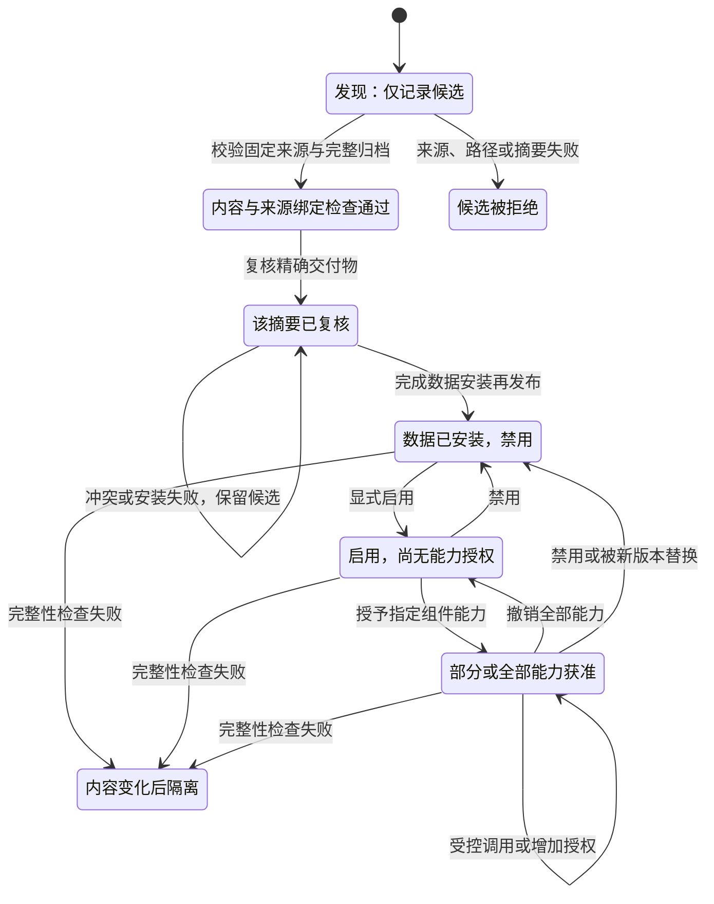

## 问题

Agent 插件从发现到执行经过哪些信任状态，如何防范路径穿越、同名抢占和更新投毒？请为包含 Skill、Hook、MCP 的插件画状态机和威胁表，区分来源校验、安装、启用及能力授权。

## 答案 · GPT-6

**市场解决“找到什么”，安装解决“存了什么”，启用决定“哪些组件进入运行时”，授权决定“这个版本能做什么”。** 四者不是同一个安全结论。插件在市场出现、下载成功或签名有效，都不能直接推出其 Hook 可以运行、MCP 可以访问网络，或 Skill 可以改变系统权限。

建议把信任记录绑定到**发布者/来源、固定源码版本、实际交付物摘要、依赖清单、组件能力及运行约束**，再让执行入口检查当前启用和授权状态。升级是一个新的候选版本，需要重新核对发生了什么变化；不能因为名称相同就继承所有旧授权。工具目录设计见 [agent-0014](agent-0014-tool-registry-design.md)，不可信指令的处理见 [agent-0017](agent-0017-prompt-injection-defense.md)，本题关注从分发到调用的生命周期。

### 1. 给版本画状态机，而不是给名字贴“安全”标签

下面是**原创教学状态机**。`checked` 只表示固定来源记录、归档结构和摘要等检查通过；`reviewed` 表示对此交付物记录了复核决定，仍不代表获得全部能力。这里的“启用”只设置调度资格，不自动加载代码；真实产品若在安装、import、注册 Hook 或启动 MCP 时已经执行代码，所需授权和隔离必须提前到该步骤，不能等执行后再询问。



升级包以新的 candidate 从 `discovered` 开始，不复用旧版本的 review/grant。教学模型在新数据安装成功后停用旧版本、清空旧授权，新版本进入 `installed_disabled`；新安装失败则保留旧版本。禁用与撤销只限制后续调度，已经运行的 Hook、子进程或远端 MCP 请求还需另行停止、收集和隔离迟到结果；它们不会因此自动回滚。

组件的信任面也不同。Skill 文本可能在进入模型上下文时造成指令注入；Hook 可由事件自动触发本地副作用；本地 MCP 配置可能启动程序，远端 MCP 则引入独立服务身份、数据出口和更新边界。**协议兼容、组件可见、组件受信任及某次调用获准需要分别表达。**

### 2. 来源、路径与名称都必须绑定实际内容

源码固定到 commit SHA 有助于复查，但 tag/branch 可以移动，Git SHA 也未必包含打包过程下载的依赖、构建产物或远端 MCP 实现。还应记录实际归档 digest、依赖锁定版本及内容摘要，必要时核对构建 provenance、发布签名和受信根。hash 与包从同一不可信入口一起到达，只能提供一致性线索，不能自证发布者身份；签名验证也不等于代码无恶意。

解包前同时检查归档成员路径和 manifest 中的组件路径：拒绝绝对路径、父目录穿越、平台分隔符歧义、链接/特殊文件、重复或规范化后冲突的名称，并约束展开大小和成员数。只检查一个相对路径字符串再拼接不够，安装根及父目录是否为链接、是否存在并发写入者、写入是否覆盖已受信文件也要考虑。最好先完整预检，再写到新建的受控暂存目录，成功后发布；失败不要留下“部分安装却已启用”的状态。

插件身份应包括发布者和来源，而不是只有显示名。短名或规范化工具名发生冲突时，应拒绝含糊绑定或要求显式选择完整身份，不应让“后扫描的目录”“项目里同名文件”自动覆盖已安装的可信来源。名称尾部加短 hash 可以降低碰撞概率，但不是绝对无碰撞证明，也不能替代来源与权限绑定。

| 分发/运行方案 | 适用条件与收益 | 代价及不适用场景 |
| --- | --- | --- |
| 受管目录、固定交付物及集中复核 | 组织需要可追踪来源和可重现部署，插件集合相对稳定；可集中检查依赖、签名及能力变化 | 更新慢、维护成本较高。不能因为目录受管就免除运行期最小权限，也不能覆盖目录外的动态依赖 |
| 开放发现、隔离预检、按版本/能力授权 | 需要较广生态和频繁迭代；允许先看元数据，再审查候选并逐项开放能力 | 命名、隔离、差异审查和撤销更复杂。若安装脚本或加载回调能绕过授权直接执行，就不宜承诺安全开放安装 |

两个方案都要考虑更新 freshness 与回滚：旧版本有有效摘要或签名，并不意味着今天仍允许重新安装。正常回滚可以是显式审批流程，不能与攻击者重放旧版本混为一谈。本文示例默认拒绝不递增的 release 计数，这是教学策略，不是完整 TUF 客户端。

### 3. 含 Skill、Hook、MCP 的威胁表与真实反例

原创包名为 `demo-publisher/notes`，origin是虚构的 `https://publisher.example.test/notes.git`；`111…111` 是40位教学标记，**不是实际Git对象**。包只含自制的 `manifest.json`、`skills/demo.md`、`hooks/audit.mock`、`mcp/report.mock` 和 `deps/helper.mock`。所有文件都是数据，不执行任何插件代码。

manifest绑定身份和组件入口，依赖声明包含精确版本与内容SHA256。模型中的受信 `Pin` 由测试显式提供；它模拟独立取得的期望身份和归档摘要，不实现签名认证。随后 `record_mock_review` 模拟记录针对该摘要的审核决定，不是对真实第三方插件的 review。

| 威胁/阶段 | 判定与处置 | 本例证据及剩余边界 |
| --- | --- | --- |
| 市场条目冒用来源或移动引用 | 候选publisher/origin/revision必须与受信Pin一致，实际归档摘要也要一致 | source_mismatch/archive_digest阻止进入checked；不证明虚构Pin背后有真实认证链 |
| 归档或组件路径穿越 | 在写入前检查全部成员、原始名称与组件入口；不静默“修复”为另一个路径 | `../escape.mock`、绝对路径、反斜杠、NUL别名、链接/特殊成员、文件/目录冲突被拒，数据目录无新增写入 |
| 同名抢占与并发安装 | 比较完整来源身份；短名冲突不隐式覆盖，名称检查与发布在同一临界区 | other发布者的notes不能覆盖现有notes；并发安装只有一个名称占用成功，另一方name_collision |
| Skill指令注入 / Hook自动执行 / MCP越权 | 安装不执行组件，启用后仍逐组件grant；运行入口再查当前版本、授权和完整性 | 未grant前mock动作数为0；只授予skill不能调用hook。没有实际模型、回调进程或MCP连接，不能据此宣称防住注入或实现沙箱 |
| 安装后依赖更新、原版本内容被替换 | 依赖版本与摘要属于交付物；变化导致旧review不覆盖，安装后内容变化则隔离并撤销grant | 仅改helper内容/版本、保持原revision时旧Pin失败；安装后改helper触发quarantined，没有新增mock调用 |
| 更新投毒、降级重放、旧授权迁移 | 新候选独立复核；成功升级停用旧版本，新版默认无grant；默认拒绝不递增release | 旧handle不能调用新版，新版启用后仍需新grant；旧/同release重建被拒。不验证真实签名到期、撤销服务或跨进程更新 |
| 解包资源耗尽、安装中途失败 | 限制压缩/展开大小和文件数；写入完成再发布，失败清理本次新目录 | 过大归档及展开量被拒；模拟OSError后新暂存目录删除，旧版本仍可使用。断电与崩溃恢复不在本次测试中 |

正常路径实测为 `discovered → checked → reviewed → installed_disabled → enabled → authorized → enabled → installed_disabled`。授权前没有组件动作；显式授予三类能力后，只记录 `skill.context`、`hook.observe`、`mcp.report.read` 三条mock动作，撤销后grant为空。这里的能力名仅表示本例的固定适配器，不证明真实工具具有只读属性；实际工具还需检查参数、目标、网络、文件及业务权限。

依赖变化不能只看插件自己的SHA。未锁定的package范围、安装时拉取的脚本、子模块、容器标签或同URL的远端MCP服务都可能改变实际执行内容。升级复核应查看代码/组件、依赖闭包、权限、外部端点与数据访问差异；变更超过旧批准范围时重新授权，而非继承一个按名称保存的“永久信任”。

### 4. 可运行 fixture 与验证范围

本例先把归档完整读入受限内存结构，检查所有成员和manifest，再向**新建的私有测试目录**逐个写普通文件，不调用 `extractall` 或任何安装器。归档上限32768 bytes，单文件展开上限4096 bytes，总展开量16384 bytes，最多12成员，压缩比上限100；这些只是教学限制。ZIP时间戳固定，便于复跑比较交付物摘要。

它采用严格ASCII小写路径子集，拒绝目录条目、绝对路径、特殊文件、未声明文件和不精确的依赖版本；真实产品可以支持更多格式，但需要相应验证，不能把简化模型当完整跨平台解包器。Manager API用同一把锁协调状态、名称发布与mock调用；同进程外部代码仍可能直接改对象或文件，不能把Python私有字段、一次路径检查或该锁当成OS隔离/TOCTOU证明。

<details>
<summary>保存为 plugin_fixture.py：仅自制归档、数据复制和 mock 动作</summary>

使用Python3.11.8运行 `python3 plugin_fixture.py`。脚本只在自身目录下建立 `yao390-owned-*` 专属临时根，结束后删除；不创建真实插件注册配置，不启动Hook/MCP或执行Skill/依赖内容。示例中的启用和审核都是模型状态，并非宿主插件操作。

```python
# file: plugin_fixture.py
"""Original toy plugin lifecycle. Writes only data in an owned test root; never loads code."""
from copy import deepcopy
from dataclasses import asdict,dataclass
from functools import wraps
from io import BytesIO
from pathlib import Path,PurePosixPath
import hashlib,json,re,shutil,stat,tempfile,threading,zipfile

ROOT=Path(__file__).resolve().parent
CAPS={'skill':'skill.context','hook':'hook.observe','mcp':'mcp.report.read'}
MAX_ARCHIVE=32768;MAX_FILE=4096;MAX_TOTAL=16384;MAX_MEMBERS=12


class Rejected(ValueError):pass
def sha(data):return hashlib.sha256(data).hexdigest()


def serialized(method):
    @wraps(method)
    def call(self,*args,**kwargs):
        with self._lock:return method(self,*args,**kwargs)
    return call


@dataclass(frozen=True)
class Claim:
    publisher: str='demo-publisher'
    name: str='notes'
    origin: str='https://publisher.example.test/notes.git'
    revision: str='1'*40  # fictional SHA-shaped marker, not an actual Git object
    release: int=1


@dataclass(frozen=True)
class Pin:
    claim: Claim
    archive_sha256: str


def safe_name(name):
    if type(name) is not str or not name or len(name)>128:raise Rejected('path_not_canonical')
    parts=name.split('/')
    reserved={'con','prn','aux','nul'}|{f'{p}{i}' for p in ('com','lpt') for i in range(1,10)}
    if any(not re.fullmatch('[a-z0-9][a-z0-9_.-]*',p) or p.endswith('.') or
           p.split('.')[0] in reserved for p in parts):raise Rejected('path_not_canonical')
    return name


def parse_json(data):
    def unique(pairs):
        out={}
        for k,v in pairs:
            if k in out:raise Rejected('duplicate_json_key')
            out[k]=v
        return out
    def invalid(_):raise Rejected('nonfinite_json')
    return json.loads(data.decode('utf-8'),object_pairs_hook=unique,parse_constant=invalid)


def inspect_bundle(blob,claim):
    if len(blob)>MAX_ARCHIVE:raise Rejected('archive_limit')
    with zipfile.ZipFile(BytesIO(blob)) as z:
        infos=z.infolist()
        if not 0<len(infos)<=MAX_MEMBERS:raise Rejected('member_limit')
        names=set();total=0
        for info in infos:
            name=safe_name(info.filename)
            if info.orig_filename!=info.filename:raise Rejected('path_not_canonical')
            if name in names:raise Rejected('duplicate_path')
            names.add(name);total+=info.file_size
            mode=stat.S_IFMT(info.external_attr>>16)
            if info.is_dir() or mode not in (0,stat.S_IFREG):raise Rejected('symlink_or_special')
            if info.flag_bits&1 or info.compress_type not in (zipfile.ZIP_STORED,zipfile.ZIP_DEFLATED):
                raise Rejected('unsupported_archive_feature')
            if (info.file_size>MAX_FILE or total>MAX_TOTAL or
                    info.file_size>100*max(info.compress_size,1)):raise Rejected('expanded_size_limit')
        if any(str(p) in names for name in names for p in PurePosixPath(name).parents if str(p)!='.'):
            raise Rejected('file_directory_collision')
        files={}
        for info in infos:
            with z.open(info) as stream:data=stream.read(MAX_FILE+1)
            if len(data)!=info.file_size or len(data)>MAX_FILE:raise Rejected('actual_size_mismatch')
            files[info.filename]=data
    if 'manifest.json' not in files:raise Rejected('manifest_missing')
    manifest=parse_json(files['manifest.json'])
    if (type(manifest) is not dict or set(manifest)!={'identity','components','dependencies'} or
            manifest['identity']!=asdict(claim)):raise Rejected('manifest_identity_or_schema')
    components=manifest['components'];deps=manifest['dependencies']
    if type(components) is not dict or set(components)!=set(CAPS) or type(deps) is not list:
        raise Rejected('component_or_dependency_schema')
    expected={'manifest.json'};dep_names=set()
    for kind,path in components.items():
        safe_name(path)
        prefix={'skill':'skills/','hook':'hooks/','mcp':'mcp/'}[kind]
        if not path.startswith(prefix) or path not in files:raise Rejected('component_path')
        expected.add(path)
    for dep in deps:
        if type(dep) is not dict or set(dep)!={'name','version','path','sha256'}:raise Rejected('dependency_schema')
        if (type(dep['name']) is not str or not re.fullmatch('[a-z0-9][a-z0-9.-]*',dep['name']) or
                dep['name'] in dep_names):raise Rejected('dependency_identity')
        dep_names.add(dep['name'])
        if type(dep['version']) is not str or not re.fullmatch(r'[0-9]+\.[0-9]+\.[0-9]+',dep['version']):
            raise Rejected('dependency_unpinned')
        path=safe_name(dep['path'])
        if not path.startswith('deps/') or path in expected or path not in files or sha(files[path])!=dep['sha256']:
            raise Rejected('dependency_digest')
        expected.add(path)
    if set(files)!=expected:raise Rejected('undeclared_file')
    return manifest,files


class Pipeline:
    def __init__(self,test_root):
        root=Path(test_root)
        if root.is_symlink() or not root.is_dir():raise Rejected('owned_root_required')
        self.root=root.resolve();self._records={};self._current={};self.effects=[];self._lock=threading.RLock()
    def _move(self,row,state):row['state']=state;row['history'].append(state)
    def _expect(self,handle,states):
        row=self._records[handle]
        if row['state'] not in states:raise Rejected('phase')
        return row
    @serialized
    def discover(self,claim,blob):
        if (not isinstance(claim,Claim) or type(claim.release) is not int or claim.release<1 or
                any(type(v) is not str for v in (claim.publisher,claim.name,claim.origin,claim.revision)) or
                not claim.origin.startswith('https://') or
                not re.fullmatch('[a-z0-9-]+',claim.publisher) or not re.fullmatch('[a-z0-9-]+',claim.name) or
                not re.fullmatch('[0-9a-f]{40}',claim.revision) or type(blob) is not bytes):
            raise Rejected('claim_schema')
        handle=f'candidate-{len(self._records)+1}'
        self._records[handle]=dict(claim=claim,blob=blob,digest=sha(blob),state='discovered',
                                   history=['discovered'],grants=set(),reviewed=None,directory=None)
        return handle
    @serialized
    def check(self,handle,pin):
        row=self._expect(handle,{'discovered'})
        try:
            if not isinstance(pin,Pin) or pin.claim!=row['claim']:raise Rejected('source_mismatch')
            if pin.archive_sha256!=row['digest']:raise Rejected('archive_digest')
            manifest,files=inspect_bundle(row['blob'],row['claim'])
        except Exception:
            self._move(row,'rejected');raise
        row.update(manifest=manifest,files=files);self._move(row,'checked')
    @serialized
    def record_mock_review(self,handle,exact_digest):
        row=self._expect(handle,{'checked'})
        if exact_digest!=row['digest']:raise Rejected('review_digest')
        row['reviewed']=exact_digest;self._move(row,'reviewed')
    @serialized
    def install_data(self,handle,fail_after=None):
        row=self._expect(handle,{'reviewed'});claim=row['claim'];old_handle=self._current.get(claim.name)
        old=self._records[old_handle] if old_handle else None
        if old:
            previous=old['claim']
            if (previous.publisher,previous.origin)!=(claim.publisher,claim.origin):raise Rejected('name_collision')
            if claim.release<=previous.release:raise Rejected('rollback_or_same_release')
        stage=Path(tempfile.mkdtemp(prefix='data-',dir=self.root))
        try:
            for i,(name,data) in enumerate(sorted(row['files'].items()),1):
                path=stage/name;path.parent.mkdir(parents=True,exist_ok=True)
                with path.open('xb') as stream:stream.write(data)
                if i==fail_after:raise OSError('synthetic installation failure')
        except BaseException:
            shutil.rmtree(stage);raise  # remove only the fresh directory this method owns
        if old:
            old['grants'].clear();self._move(old,'installed_disabled')
        row['directory']=stage;self._current[claim.name]=handle;self._move(row,'installed_disabled')
    def _installed(self,handle):
        row=self._records[handle]
        if self._current.get(row['claim'].name)!=handle or row['directory'] is None:raise Rejected('stale_install')
        base=row['directory']
        try:
            if base.is_symlink() or not base.is_dir():raise Rejected('integrity_changed')
            actual={}
            for path in base.rglob('*'):
                if path.is_symlink():raise Rejected('integrity_changed')
                if path.is_file():
                    if path.stat().st_size>MAX_FILE:raise Rejected('integrity_changed')
                    actual[path.relative_to(base).as_posix()]=path.read_bytes()
            if actual!=row['files']:raise Rejected('integrity_changed')
        except Exception:
            row['grants'].clear();self._move(row,'quarantined');raise
        return row
    @serialized
    def enable(self,handle):
        row=self._expect(handle,{'installed_disabled'});self._installed(handle);self._move(row,'enabled')
    @serialized
    def grant(self,handle,components):
        row=self._expect(handle,{'enabled','authorized'});self._installed(handle);requested=set(components)
        if not requested or not requested<=set(CAPS):raise Rejected('capability_scope')
        row['grants']|=requested;self._move(row,'authorized')
    @serialized
    def invoke_mock(self,handle,component):
        row=self._expect(handle,{'authorized'});self._installed(handle)
        if component not in row['grants']:raise Rejected('capability_not_granted')
        self.effects.append(dict(plugin=row['claim'].publisher+'/'+row['claim'].name,
                                 artifact=row['digest'],capability=CAPS[component]))
    @serialized
    def revoke_all(self,handle):
        row=self._expect(handle,{'authorized'});row['grants'].clear();self._move(row,'enabled')
    @serialized
    def disable(self,handle):
        row=self._expect(handle,{'enabled','authorized'});row['grants'].clear();self._move(row,'installed_disabled')
    @serialized
    def snapshot(self,handle):
        row=self._records[handle]
        return deepcopy(dict(state=row['state'],history=row['history'],grants=sorted(row['grants']),
                             identity=asdict(row['claim']),artifact=row['digest']))


def make_bundle(claim=Claim(),dependency=b'original synthetic helper v1',dep_version='1.0.0',extra=()):
    files={'skills/demo.md':b'Original teaching Skill text; never injected into a model.',
           'hooks/audit.mock':b'Original mock Hook data; not executable.',
           'mcp/report.mock':b'Original mock MCP descriptor; no server is started.',
           'deps/helper.mock':dependency}
    manifest=dict(identity=asdict(claim),components=dict(skill='skills/demo.md',hook='hooks/audit.mock',mcp='mcp/report.mock'),
                  dependencies=[dict(name='fixture-helper',version=dep_version,path='deps/helper.mock',sha256=sha(dependency))])
    files['manifest.json']=json.dumps(manifest,sort_keys=True).encode()
    buffer=BytesIO()
    with zipfile.ZipFile(buffer,'w',compression=zipfile.ZIP_DEFLATED) as z:
        for name,data in [*files.items(),*extra]:
            info=zipfile.ZipInfo(name,(2020,1,1,0,0,0)) if type(name) is str else name
            if type(name) is str:info.external_attr=(stat.S_IFREG|0o600)<<16
            info.compress_type=zipfile.ZIP_DEFLATED;z.writestr(info,data)
    return buffer.getvalue()


def demo():
    claim=Claim();blob=make_bundle(claim)
    with tempfile.TemporaryDirectory(prefix='yao390-owned-',dir=ROOT) as name:
        root=Path(name);pipeline=Pipeline(root);handle=pipeline.discover(claim,blob)
        pipeline.check(handle,Pin(claim,sha(blob)));pipeline.record_mock_review(handle,sha(blob))
        pipeline.install_data(handle);pipeline.enable(handle)
        before=len(pipeline.effects);pipeline.grant(handle,['skill','hook','mcp'])
        for kind in CAPS:pipeline.invoke_mock(handle,kind)
        pipeline.revoke_all(handle);pipeline.disable(handle)
        result=dict(state=pipeline.snapshot(handle),effects_before_grant=before,effects=pipeline.effects,
                    all_paths_in_root=all(p.resolve().is_relative_to(root.resolve()) for p in root.rglob('*')))
    result['temporary_directory_removed']=not root.exists()
    return result


if __name__=='__main__':print(json.dumps(demo(),ensure_ascii=False,indent=2))
```

</details>

2026-09-16实测：**27 个测试通过**。27个测试根分别检查并清理，哨兵文件字节不变；独立demo目录也已删除。两个并发安装线程已join，只有一个名称占用成功。测试覆盖状态跳跃、固定来源/摘要、穿越与链接、NUL/重复路径、资源预算、未声明安装文件、依赖锁定、同名替换、升级/回滚、逐组件grant、失败清理、安装后篡改和返回快照不可改写授权。

测试只验证这些自制归档和mock合同，没有安装或启用真实插件，没有读取凭据或修改用户配置。真实发布者身份、签名/TUF更新验证、第三方代码行为、模型注入防御、沙箱隔离、恶意并发文件系统写入、持久授权、崩溃原子性、在途任务回收和远端MCP实现变化仍需独立工程证据。

### 5. 固定一手来源支持什么，不支持什么

**TUF Specification v1.0.36**描述Root、Targets、Snapshot、Timestamp等角色及受信根：Root确定哪些密钥受信；Targets绑定目标文件摘要/长度及委托；Snapshot和Timestamp参与防止混配、回滚、冻结等更新攻击。这解释了为什么不能仅相信市场返回的一个hash或一个旧签名。但TUF处理的是更新分发的信任与一致性，不代替插件代码审阅或运行能力授权。本文没有实现TUF协议。

**CPython3.11.8**的zipfile文档提醒先检查不可信归档，讨论资源耗尽与中断导致的不完整解包；`extract`会尝试剥离绝对/父目录等部分，并有平台差异。本文选择拒绝非规范路径而不是沿用其自动改名语义。固定源码的`ZipInfo`保留`orig_filename`并对NUL作截断，所以本例也比较原始名与处理后名称，避免只看截断结果。没有据此断言所有Python版本的解包行为相同。

课程中的具体市场或运行时优先级、插件根自动信任、未来版本批准习惯只作学习线索，未在本题固定一手实现中验证的细节不作为通用保证。

## 追问

**追问：只固定插件Git SHA，为什么仍可能升级投毒？**

构建/安装可能另取浮动依赖，远端服务也可能在同一地址更换实现。需要核对有效交付物与依赖闭包，限制安装脚本及网络获取，并把外部能力变化纳入复核；Git SHA只能固定它实际覆盖的内容。

**追问：同名插件都通过来源校验，怎么处理？**

来源校验不决定别名归属。使用完整身份和明确的选择规则，短名冲突时拒绝或请用户选择，不以扫描顺序覆盖。名称占用和发布还要原子协调，避免两个安装同时通过检查。

**追问：禁用插件是不是就收回所有影响？**

只能阻止后续调度及撤销未来授权。已经执行的副作用、在途MCP请求和注入过的上下文不会自动回滚；需要进程/任务管理、结果世代隔离和业务补偿。

**追问：一个只提供Skill文本的插件还需要审核吗？**

需要，它可以影响模型行为和后续工具选择。审核其来源、内容及注入上下文的权限，保持不可信指令与强制策略分离；“不含可执行脚本”不等于不会扩大实际风险。

## 常见误区

- **“市场收录即安全。”** 发现、来源校验、语义审阅和运行授权是不同证据。
- **“安装成功就可以启动所有Hook/MCP。”** 加载和启动本身可能执行代码，必须事先明确能力门槛。
- **“安装后的依赖更新不影响已有信任。”** 它改变实际执行内容，旧review/grant可能不再适用。
- **“同名、同目录或相同短hash就代表同一个可信插件。”** 要绑定完整来源和交付物，并明确冲突策略。
- **“签名有效说明代码无恶意；禁用等于回滚。”** 签名与行为审查不同，撤销未来能力也不会抹去过去的效果。

## 参考

来源核对于2026-09-16；题干、状态图、威胁表、fixture与测试均独立组织。未搬运AGPL课件正文、代码或图片。

- 洛小山《AI 产品从入门到精通》，learn-ai固定 `5a933d287dd5074cc1543cb849146f3261d47521`：[slides/12-21.html](https://github.com/itshen/learn-ai/blob/5a933d287dd5074cc1543cb849146f3261d47521/slides/12-21.html)（市场与信任）、[slides/dsh-21.html](https://github.com/itshen/learn-ai/blob/5a933d287dd5074cc1543cb849146f3261d47521/slides/dsh-21.html)（MCP与扩展能力）；[AGPL-3.0 LICENSE](https://github.com/itshen/learn-ai/blob/5a933d287dd5074cc1543cb849146f3261d47521/LICENSE)。
- The Update Framework Working Group，**The Update Framework Specification v1.0.36**，固定commit `59e601ed29c0d2e497264ae8b31c11b8ef07df1e`：[tuf-spec.md](https://github.com/theupdateframework/specification/blob/59e601ed29c0d2e497264ae8b31c11b8ef07df1e/tuf-spec.md)，`Roles`、`File formats`与`Detailed client workflow`等章节；[Community Specification License 1.0](https://github.com/theupdateframework/specification/blob/59e601ed29c0d2e497264ae8b31c11b8ef07df1e/LICENSE.md)。本文仅独立讨论机制，不提供TUF兼容性或安全认证。
- Python Software Foundation，**CPython v3.11.8**，tag对应 `db85d51d3ea4adfc6147d6af400e167659689eed`：[zipfile文档](https://github.com/python/cpython/blob/db85d51d3ea4adfc6147d6af400e167659689eed/Doc/library/zipfile.rst) 的`extract`/`extractall`、`Decompression pitfalls`；[Lib/zipfile.py](https://github.com/python/cpython/blob/db85d51d3ea4adfc6147d6af400e167659689eed/Lib/zipfile.py) 的`ZipInfo.__init__`（374起的原始名/NUL处理）和`_extract_member`；[LICENSE](https://github.com/python/cpython/blob/db85d51d3ea4adfc6147d6af400e167659689eed/LICENSE)含PSF License Version2、历史许可及文档代码示例Zero-Clause BSD条款。本题代码为原创，未复制文档示例。
