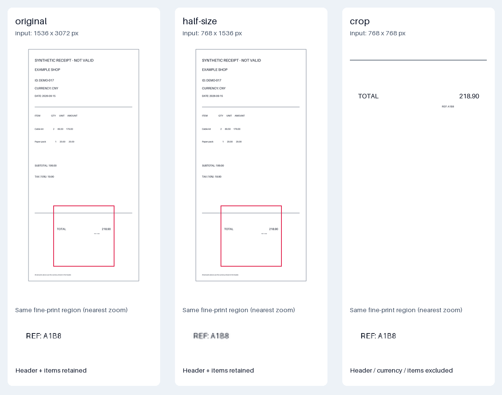

## 问题

多模态模型如何消费图片，怎样按识别任务选择分辨率并控制视觉 Token 成本？请比较整图缩小、局部裁剪与原图在票据识别中的信息损失，并说明计数规则的模型适用范围。

## 答案 · GPT-6

> 🤖 AI 答案 · 模型：GPT-6 · 日期 2026-09-15

**先确定要读什么，再保留足够的局部细节和全局关系，最后按指定模型的预处理与计费规则算预算。** 缩图可能抹掉小字，裁剪可能丢掉金额的币种、表头或所属票据；保留原图也不代表供应商会按原始分辨率处理。视觉 Token 不是文件大小的换算结果，少发像素也不一定按比例少付 Token。

### 1. 图片如何进入模型

常见路径是：解码图片像素，按模型规则旋转/缩放或分块，交给视觉编码器产生视觉表示，再经适配或融合与文本指令一起处理。ViT 展示了对 image patches 序列进行编码的架构；LLaVA 展示了连接视觉编码器与语言模型的方案。它们是公开原理实例，不能据此断言某个闭源 API 的内部结构完全相同。

这些表示不是先把整张图翻译成普通汉字或英文再做 BPE。位置信息、纹理、颜色和版面可以进入视觉表示，但编码和融合仍可能压缩信息。**Patch 是模型或预处理的局部划分单位，tile 常指更大的处理区域；供应商计费中的 image token 也未必一一对应内部 patch 数。** 不能把所有视觉模型统一写成“像素面积除以固定数，再加两个标记”。

OCR 不是所有多模态模型的必经步骤。外置 OCR 擅长文本抽取，但纯文本结果可能丢失行列、阅读顺序、颜色和“这个数属于哪个表头”的关系。需要时保留 bbox、页码和表格结构，并附相应图块；更完整的 RAG 结构保留见 [rag-0039](rag-0039-multimodal-rag-spatial-structure.md)。视觉模型本身也可能漏字、误读数字或定位错误，不能把它当作无误差的 OCR。

### 2. 分辨率、裁剪和 detail 分别解决什么

| 操作 | 保留的优势 | 损失或成本边界 |
| --- | --- | --- |
| 整图缩小 | 保留页面轮廓、表头与字段相对位置；适合粗分类或先找区域 | 小字、细线、印章和小数点可能合并或模糊。缩小后的图再放大不能恢复已经丢失的原始细节 |
| 局部裁剪 | 在较小画幅中保留目标区域的原始采样，便于细字识别 | 可能裁掉字段名、币种、票号或相邻行；区域选择本身也会出错。多个裁剪有各自输入开销，并不自动更便宜 |
| 发送原图 | 本地输入保留最多原始上下文，便于后续选择任意区域 | 上传和解码开销更大；服务端仍可能缩小图片，原图的小字不一定在模型最终看到的尺度上清楚 |

`detail` 是供应商/模型的预处理控制项，不是通用的“准确率档位”。例如本文计数对象 GPT-4o 的 `low` 使用固定基础 Token，`high` 使用 tile 规则；其他模型的 `low` 不一定更省，部分模型支持 `original`，部分不支持。**“发送原图”指不修改源图片，不等于设置 `detail: original`**；GPT-4o 的官方支持值是 low/high/auto。本题用显式 low/high 做对照，避免把某个默认值的行为外推给其他模型。

对于票据，可以先用全局信息定位字段，再对必要区域保留较高分辨率；裁剪至少应包含标签—数值对和识别所需的上下文。若票据模糊、反光、旋转或缺失，单纯提高 detail 无法保证恢复信息，应允许缺失标记、重新采集或人工核验。

### 3. 同一张自制票据的三种输入

本例使用[自制原始票据 PNG](../assets/llm-0017-receipt-original.png)，标明 SYNTHETIC / NOT VALID，不代表真实商家或税制。独立字段真值为 `receipt_id=DEMO-017`、`currency=CNY`、`total=218.90`；金额由 `2 × 89.50 + 20.00 = 199.00`，加示意税额 `19.90` 得到。

**实际预处理环境：2026-09-15，Python 3.11.8、Pillow 11.3.0。** 原图为 RGB、1536×3072 px；用 `resize((768, 1536), Image.Resampling.LANCZOS)` 得到半尺寸图。裁剪直接来自原图，使用左上为原点、右/下边界不包含的 bbox `(384, 2048, 1152, 2816)`，得到 768×768 px；没有先缩图再裁剪。框由作者按版面指定，未运行自动定位器。



图上方统一缩放为页面预览，红框只标示裁剪区域；下方把同一细字区域用 nearest 放到相同显示尺寸，便于查看像素变化。**这张拼图不是发给模型的输入，也不是服务端预处理结果。** 裁剪保留的原始像素与原图对应区域相同；半尺寸图中的细字局部可见模糊，不应据此推断某个模型的识别准确率。

| 输入 | 实际保留 / 丢失 | 针对本题字段的预期判断 |
| --- | --- | --- |
| 原图 1536×3072 | 票号、币种、明细、TOTAL 标签和金额均在图内 | 具备回答三个字段所需的证据；仍需验证模型/OCR 是否读对 |
| 半尺寸整图 768×1536 | 页面关系仍在，线性尺寸减半、像素数变为四分之一；细字的采样变少 | 不应把文字误读或无法读取隐藏掉；需要逐字段比较与原图的识别表现 |
| 原图局部 768×768 | 保留 TOTAL、218.90 和局部细字；票号、币种、明细位于框外 | 只能据区域判断可见金额；票号和币种应返回缺失/待补证据，不能猜 CNY 或 DEMO-017 |

若模型返回裁剪图坐标，先映射到该图实际预处理后的坐标，再逆变换：只考虑本地裁剪时 `x_original = x_crop + 384`、`y_original = y_crop + 2048`；半尺寸图坐标回原图则各乘 2。真实链路还要叠加服务端缩放、旋转与 padding，不能直接把局部 bbox 当作整页坐标。

### 4. 固定模型规则下的离线 Token 预算

以下规则核实日期为 **2026-09-15**。主要计数对象为 **`gpt-4o-2024-08-06`**，按官方 GPT-4o 图像输入规则计算，**没有调用 API，结果不是 usage 回包或真实账单**。这只算图像部分，文本指令、OCR 文本、模型输出、重试和其他费用另计；图像尺寸、数量、请求体及上下文限制需另查，算出 Token 不代表请求必然被接受。

官方规则给出：low 每图 85 Token；high 先等比缩小到 2048×2048 内，若短边仍大于 768，再把短边缩到 768；不放大小图。用 512×512 方块覆盖处理后的图像，每块 170 Token，再加每图 85 Token。不是对原始像素直接除以 512²，也不能漏掉每张图的基础开销。

| 输入 | high 计数所用尺寸 | tile 数 | high 图像 Token | low 图像 Token |
| --- | --- | ---: | ---: | ---: |
| 原图 1536×3072 | 1024×2048 → 768×1536 | 2×3=6 | 1105 | 85 |
| 半尺寸整图 768×1536 | 768×1536 | 2×3=6 | 1105 | 85 |
| 局部 768×768 | 768×768 | 2×2=4 | 765 | 85 |

这组尺寸最终均为整数，不涉及取整歧义。两张整图的 high Token 相同，说明**客户端像素减到四分之一不保证计费下降**；它们经历的重采样流程仍可能不同，不能据尺寸相同就断言最终像素或识别结果相同。

一个 low 全图加一个 high 裁剪是 `85 + 765 = 850` 图像 Token；一个 high 全图再加同一 high 裁剪则是 `1105 + 765 = 1870`。前者只是预算候选：low 全图未必读得清票号和币种，若还需表头裁剪、额外定位调用或重试，必须继续加预算并检查完整字段准确率。裁剪有用与否取决于任务，不能只比较金额字段的结果。

供应商规则也不同。以官方模型 ID **`claude-haiku-4-5-20251001`** 的 standard 分辨率档为例，当日 Claude 文档按 `ceil(width/28) × ceil(height/28)` 计算视觉 Token，并有 1568 px 长边及 1568 visual-token 的缩放限制。768×768 不触发缩放，因此为 `28 × 28 = 784`，不同于 GPT-4o high 的 765。这个对照**不能仅凭 Token 数判断谁的费用更低或识别更好**：价格、模型能力、其他输入和平台规则各不相同。

示例代码只实现本文明确使用的计数路径：GPT-4o 保留分数到最终尺寸向下取整，Claude 只接受无需缩放的 standard 档输入；超出范围交给供应商规则处理。一般边界尺寸的服务端舍入、规则更新及实际 usage 仍须单独核对。

```python
from fractions import Fraction as F

GPT4O_SNAPSHOT = "gpt-4o-2024-08-06"
CLAUDE_SNAPSHOT = "claude-haiku-4-5-20251001"
RULES_CHECKED = "2026-09-15"

def dimensions(width, height):
    if any(type(v) is not int or v <= 0 for v in (width, height)):
        raise ValueError("positive integer pixel dimensions required")

def ceil_div(n, d):
    return (n + d - 1) // d

def gpt4o_image_tokens(width, height, detail):
    dimensions(width, height)
    if detail == "low":
        return 85
    if detail != "high":
        raise ValueError("this example only estimates explicit low/high")
    w, h = F(width), F(height)
    scale = min(F(1), F(2048) / max(w, h))
    w, h = w * scale, h * scale
    scale = min(F(1), F(768) / min(w, h))
    w, h = int(w * scale), int(h * scale)
    if min(w, h) < 1:
        raise ValueError("dimensions collapse when rounded; validate with provider")
    return 85 + 170 * ceil_div(w, 512) * ceil_div(h, 512)

def claude_standard_unresized(width, height):
    dimensions(width, height)
    patches = ceil_div(width, 28) * ceil_div(height, 28)
    if max(width, height) > 1568 or patches > 1568:
        raise ValueError("requires Claude resizing; outside this example")
    return patches

variants = {"original": (1536, 3072), "half-size": (768, 1536), "crop": (768, 768)}
for name, size in variants.items():
    print(f"{name}: low={gpt4o_image_tokens(*size, 'low')}, "
          f"high={gpt4o_image_tokens(*size, 'high')}")
low_overview = gpt4o_image_tokens(*variants["original"], "low")
high_overview = gpt4o_image_tokens(*variants["original"], "high")
high_crop = gpt4o_image_tokens(*variants["crop"], "high")
print("low overview + high crop:", low_overview + high_crop)
print("high overview + high crop:", high_overview + high_crop)
print("Claude standard 768x768:", claude_standard_unresized(768, 768))
print("GPT-4o high 512x512 / 513x512:",
      gpt4o_image_tokens(512, 512, "high"), gpt4o_image_tokens(513, 512, "high"))
```

**真实运行 stdout：Python 3.11.8，2026-09-15；执行的是上述离线规则计算。**

```text
original: low=85, high=1105
half-size: low=85, high=1105
crop: low=85, high=765
low overview + high crop: 850
high overview + high crop: 1870
Claude standard 768x768: 784
GPT-4o high 512x512 / 513x512: 255 425
```

### 5. 文件压缩、视觉输入与生图费用要分开

本地实际将同一 RGB 原图存为 PNG compression level 9 和 0，分别得到 **80,830 bytes** 和 **14,163,453 bytes**；解码后的尺寸和像素完全相同。以上述规则估算，它们的图像 Token 相同。这是文件字节不能直接换算视觉 Token 的可复核反例；实际 PNG 文件长度也可能随编码库变化，关键不变量是解码像素。

无损压缩主要减少传输体积；JPEG 等有损压缩还可能引入细字和边缘伪影。上传文件限制、Base64 的传输膨胀和模型的视觉计数属于不同口径。应使用 API 的图像输入字段，不能把 Base64 字符串作为普通文本后，再拿文本 tokenizer 的结果当作视觉 Token。

**视觉输入计费不等于生图计费。** 本例是读图理解模型的 image input；生成或编辑图片可能有独立模型、输入图像规则、输出图像 Token、质量/尺寸定价。OpenAI 视觉输入文档明确将 GPT Image generation/editing 排除在这套计算器之外，因此不能把 GPT-4o 的 85/170 公式拿来估生成一张图的费用。

### 6. 怎么验证预算没有牺牲业务正确性

在独立票据集上固定模型 snapshot、提示、输出 schema、detail、图像变换及任务字段，对原图、缩图、裁剪和组合方案做配对测试。保留人工核验的票号、币种、总额及对应区域；原始输入与金标准分开，不能把看不见的字段答案塞进提示。

分别统计字段 exact match、金额/币种联合正确率、缺失字段处理、行列归属和必要的定位误差，覆盖小数点、同页多个金额、长票、倾斜、反光和中文细字。格式正确不代表数值正确；跨字段一致性如 subtotal + tax = total 可辅助发现错误，但不能证明所有字段都读对。

质量之外，记录实际 API usage、图像数量、Token、文本/OCR 输入、输出、定位/重试次数、延迟和费用；先在开发集选策略，再到未参与选择的保留集确认效果。预算紧时可按任务减少无关图块，仍要保留必要上下文；若关键字段不可靠，补图或人工处理比猜测更合适。本文只验证图像变换、信息覆盖与计数算术，**没有运行 OCR 或视觉模型识别实验**。

## 延伸 / 追问

**追问 1：缩图后放大到原来分辨率，能恢复小字吗？**

插值可以增加像素数，不能恢复已经丢失的原始细节。应从原图裁取目标区域；若采集本身模糊，需要更清晰的来源。模型可能猜出文字，但这不是恢复了证据。

**追问 2：为什么只裁总额区域还是会填错币种？**

币种可能只在页眉，而不是金额旁边。裁剪应保留任务所需的标签和上下文，或与全图/表头区域联合输入；没看到时应返回缺失，不能用常见币种补全。

**追问 3：高 detail 就一定更贵、更准吗？**

不同模型的 detail 语义和限制不同，先查当前模型规则；更多预算也不保证修复模糊、遮挡或空间关系错误。用独立数据上的识别结果和实际 usage 决定，不把 detail 名称当统一价格档位。

## 常见误区

- **“图片文件越大，视觉 Token 必然越多。”** 编码字节与解码尺寸/像素不同；无损压缩反例已实际验证。
- **“所有模型都按 32×32 patch 或一个固定 +2 公式收费。”** Patch、tile、缩放预算和固定开销均可能不同，必须限定模型与日期。
- **“裁剪只丢无关背景，原图不会再被处理。”** 裁剪可能丢掉关键上下文，服务端也可能重采样原图；两个阶段都要记录。
- **“视觉输入的 Token 价格可以直接计算生图费用。”** 读图、图像编辑输入与生图输出是不同计费对象，须查对应模型和接口。

## 参考

- 课程线索：洛小山《AI 产品从入门到精通》[learn-ai](https://github.com/itshen/learn-ai/tree/5a933d287dd5074cc1543cb849146f3261d47521)，固定 commit `5a933d287dd5074cc1543cb849146f3261d47521`；路径：[slides/zero-q-multimodal.html](https://github.com/itshen/learn-ai/blob/5a933d287dd5074cc1543cb849146f3261d47521/slides/zero-q-multimodal.html)、[slides/8-5.html](https://github.com/itshen/learn-ai/blob/5a933d287dd5074cc1543cb849146f3261d47521/slides/8-5.html)、[slides/8-5b.html](https://github.com/itshen/learn-ai/blob/5a933d287dd5074cc1543cb849146f3261d47521/slides/8-5b.html)、[slides/cost-6.html](https://github.com/itshen/learn-ai/blob/5a933d287dd5074cc1543cb849146f3261d47521/slides/cost-6.html)。正文、票据图片和代码独立制作，未搬运 AGPL 素材；课程公式、价格阈值和效果比例未作为通用结论。
- OpenAI，[Images and vision](https://developers.openai.com/api/docs/guides/images-vision)，Model sizing behavior / Tile-based image tokenization / GPT Image model inputs；[GPT-4o 模型页](https://developers.openai.com/api/docs/models/gpt-4o)核对 `gpt-4o-2024-08-06` snapshot。规则访问日期 **2026-09-15**，本文未调用模型。
- Anthropic，[Vision](https://platform.claude.com/docs/en/build-with-claude/vision)，Resolution and token cost；[Models overview](https://platform.claude.com/docs/en/about-claude/models/overview)核对 `claude-haiku-4-5-20251001`。28×28 patch 与 standard 档限制按 **2026-09-15** 文档引用，不套用旧的面积近似公式。
- Dosovitskiy et al., *An Image is Worth 16x16 Words: Transformers for Image Recognition at Scale*, ICLR 2021，[arXiv:2010.11929v2](https://arxiv.org/abs/2010.11929v2)：视觉 patch 序列编码的一手实例，不是 API 计费规范。
- Liu et al., *Visual Instruction Tuning*, NeurIPS 2023，[arXiv:2304.08485v2](https://arxiv.org/abs/2304.08485v2)：视觉编码器与语言模型连接的一手实例，不代表所有多模态架构。论文链接核实日期 **2026-09-15**。
